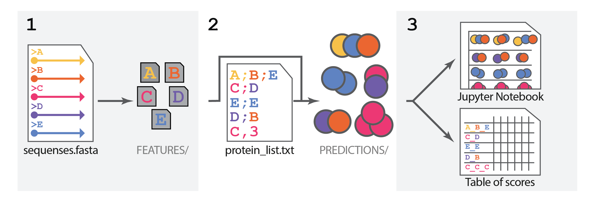
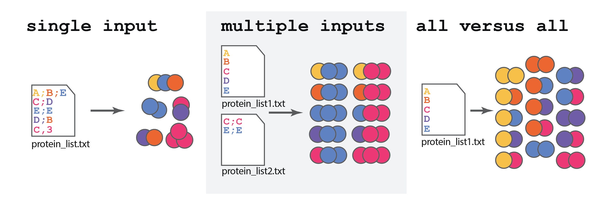
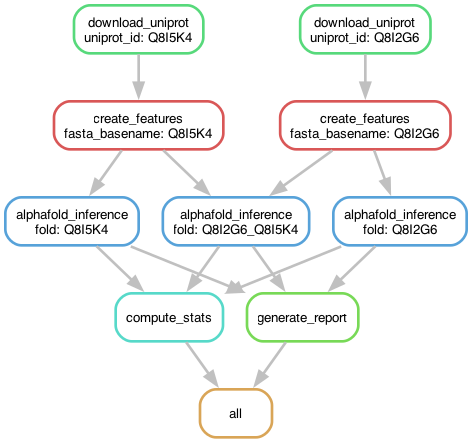
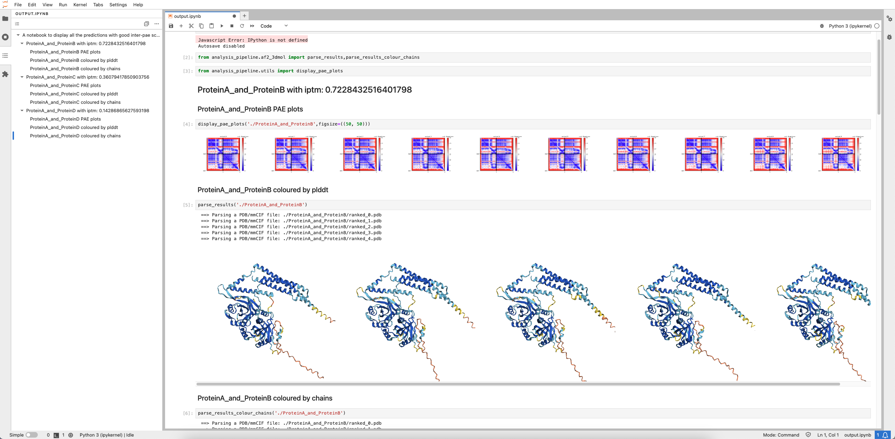

# AlphaPulldown: Version 2.x.

> AlphaPulldown fully **maintains backward compatibility** with input files and scripts from versions 1.x.

## How to Cite

If AlphaPulldown contributed significantly to your research, please cite the corresponding publication in *Bioinformatics*:

```bibtex
@article{Molodenskiy2025AlphaPulldown2,
  author    = {Molodenskiy, Dmitry and Maurer, Valentin J. and Yu, Dingquan and Chojnowski, Grzegorz and Bienert, Stefan and Tauriello, Gerardo and Gilep, Konstantin and Schwede, Torsten and Kosinski, Jan},
  title     = {AlphaPulldown2—a general pipeline for high-throughput structural modeling},
  journal   = {Bioinformatics},
  volume    = {41},
  number    = {3},
  pages     = {btaf115},
  year      = {2025},
  doi       = {10.1093/bioinformatics/btaf115}
}
```

---

## Table of Contents

<!-- TOC start (generated with https://github.com/derlin/bitdowntoc) -->

- [AlphaPulldown: Version 2.x.](#alphapulldown-version-201)
   * [Table of Contents](#table-of-contents)
- [About AlphaPulldown](#about-alphapulldown)
   * [Overview](#overview)
- [Alphafold databases](#alphafold-databases)
- [Snakemake AlphaPulldown ](#snakemake-alphapulldown)
   * [1. Installation](#1-installation)
   * [2. Configuration](#2-configuration)
   * [3. Execution](#3-execution)
- [Run AlphaPulldown Python Command Line Interface](#run-alphapulldown-python-command-line-interface)
   * [0. Installation](#0-installation)
      + [0.1. Create Anaconda environment](#01-create-anaconda-environment)
      + [0.2. Installation using pip](#02-installation-using-pip)
      + [0.3. Installation for the Downstream analysis tools](#03-installation-for-the-downstream-analysis-tools)
      + [0.4. Installation for cross-link input data by AlphaLink2 (optional!)](#04-installation-for-cross-link-input-data-by-alphalink2-optional)
      + [0.5. Installation for developers](#05-installation-for-developers)
   * [1. Compute multiple sequence alignment (MSA) and template features (CPU stage)](#1-compute-multiple-sequence-alignment-msa-and-template-features-cpu-stage)
      + [1.1. Basic run](#11-basic-run)
         - [Input](#input)
         - [Script Execution](#script-execution)
         - [Output](#output)
         - [Next step](#next-step)
      + [1.2. Example bash scripts for SLURM (EMBL cluster)](#12-example-bash-scripts-for-slurm-embl-cluster)
         - [Input](#input-1)
         - [Script Execution](#script-execution-1)
         - [Next step](#next-step-1)
      + [1.3. Run using MMseqs2 and ColabFold Databases (Faster)](#13-run-using-mmseqs2-and-colabfold-databases-faster)
         - [Run MMseqs2 Remotely](#run-mmseqs2-remotely)
         - [Output](#output-1)
         - [Run MMseqs2 Locally](#run-mmseqs2-locally)
         - [Next step](#next-step-2)
      + [1.4. Run with custom templates (TrueMultimer)](#14-run-with-custom-templates-truemultimer)
         - [Input](#input-2)
         - [Script Execution](#script-execution-2)
         - [Output](#output-2)
         - [Next step](#next-step-3)
   * [2. Predict structures (GPU stage)](#2-predict-structures-gpu-stage)
      + [2.1. Basic run](#21-basic-run)
         - [Input](#input-3)
         - [Script Execution: Structure Prediction](#script-execution-structure-prediction)
         - [Output](#output-3)
         - [Next step](#next-step-4)
      + [2.2. Example run with SLURM (EMBL cluster)](#22-example-run-with-slurm-embl-cluster)
         - [Input](#input-4)
         - [Script Execution](#script-execution-3)
         - [Output and the next step](#output-and-the-next-step)
      + [2.3. Pulldown mode](#23-pulldown-mode)
         - [Multiple inputs "pulldown" mode](#multiple-inputs-pulldown-mode)
      + [2.4. All versus All mode](#24-all-versus-all-mode)
         - [Output and the next step](#output-and-the-next-step-1)
      + [2.5. Run with Custom Templates (TrueMultimer)](#25-run-with-custom-templates-truemultimer)
         - [Input](#input-5)
         - [Script Execution for TrueMultimer Structure Prediction](#script-execution-for-truemultimer-structure-prediction)
         - [Output and the next step](#output-and-the-next-step-2)
      + [2.6. Run with crosslinking-data (AlphaLink2)](#26-run-with-crosslinking-data-alphalink2)
         - [Input](#input-6)
         - [Run with AlphaLink2 prediction via AlphaPulldown](#run-with-alphalink2-prediction-via-alphapulldown)
         - [Output and the next step](#output-and-the-next-step-3)
   * [3. Analysis and Visualization](#3-analysis-and-visualization)
      + [Create Jupyter Notebook](#create-jupyter-notebook)
         - [Next step](#next-step-5)
      + [Create Results table](#create-results-table)
         - [Next step](#next-step-6)
- [Downstream analysis](#downstream-analysis)
   * [Jupyter notebook](#jupyter-notebook)
   * [Results table ](#results-table)
   * [Results management scripts](#results-management-scripts)
      + [Decrease the size of AlphaPulldown output](#decrease-the-size-of-alphapulldown-output)
      + [Convert Models from PDB Format to ModelCIF Format](#convert-models-from-pdb-format-to-modelcif-format)
         - [1. Convert all models to separate ModelCIF files](#1-convert-all-models-to-separate-modelcif-files)
         - [2. Only convert a specific single model for each complex](#2-only-convert-a-specific-single-model-for-each-complex)
         - [3. Have a representative model and keep associated models](#3-have-a-representative-model-and-keep-associated-models)
         - [Associated Zip Archives](#associated-zip-archives)
         - [Miscellaneous Options](#miscellaneous-options)
- [Features Database](#features-database)
   * [Installation](#installation)
      + [Steps:](#steps)
      + [Verify installation:](#verify-installation)
   * [Configuration](#configuration)
   * [Downloading Features](#downloading-features)
      + [List available organisms:](#list-available-organisms)
      + [Download specific protein features:](#download-specific-protein-features)
      + [Download all features for an organism:](#download-all-features-for-an-organism)

<!-- TOC end -->

# About AlphaPulldown

AlphaPulldown is a customized implementation of [AlphaFold-Multimer](https://github.com/google-deepmind/alphafold) designed for customizable high-throughput screening of protein-protein interactions. It extends AlphaFold’s capabilities by incorporating additional run options, such as customizable multimeric structural templates (TrueMultimer), [MMseqs2](https://github.com/soedinglab/MMseqs2) multiple sequence alignment (MSA) via [ColabFold](https://github.com/sokrypton/ColabFold) databases, protein fragment predictions, and the ability to incorporate mass spec data as an input using [AlphaLink2](https://github.com/Rappsilber-Laboratory/AlphaLink2/tree/main).

AlphaPulldown can be used in two ways: either by a two-step pipeline made of **python scripts**, or by a **Snakemake pipeline** as a whole. For details on using the Snakemake pipeline, please refer to the separate GitHub [**repository**](https://github.com/KosinskiLab/AlphaPulldownSnakemake).

To enable faster usage and avoid redundant feature recalculations, we have developed a [public database](https://alphapulldown.s3.embl.de/index.html) containing precomputed features for all major model organisms, available for download. You can check the full list and download individual features at https://alphapulldown.s3.embl.de/index.html or https://s3.embl.de/alphapulldown/index.html. 

For more details, [click here](https://github.com/KosinskiLab/AlphaPulldown/blob/main/README.md#features-database).
## Overview

<picture>
  <source media="(prefers-color-scheme: dark)" srcset="./manuals/AP_pipeline_dark.png">
  <source media="(prefers-color-scheme: light)" srcset="./manuals/AP_pipeline.png">
  
</picture>

<p align='center'> <strong>Figure 1</strong> Overview of AlphaPulldown worflow </p>

The AlphaPulldown workflow involves the following 3 steps:

1. **Create and store MSA and template features**: 

   In this step, AlphaFold searches preinstalled databases using HMMER for each queried protein sequence and calculates multiple sequence alignments (MSAs) for all found homologs. It also searches for homolog structures to use as templates for feature generation. This step only requires CPU.

   Customizable options include:
   * To speed up the search process, [MMSeq2](https://doi.org/10.1038/s41592-022-01488-1) can be used instead of the default HHMER.
   * Use custom MSA.
   * Use a custom structural template, including a multimeric one (TrueMultimer mode).

2. **Structure prediction**: 

   In this step, the AlphaFold neural network runs and produces the final protein structure, requiring GPU. A key strength of AlphaPulldown is its ability to flexibly define how proteins are combined for the structure prediction of protein complexes. Here are the three main approaches you can use:
   
   <picture>
     <source media="(prefers-color-scheme: dark)" srcset="./manuals/AP_modes_dark.png">
     <source media="(prefers-color-scheme: light)" srcset="./manuals/AP_modes.png">
     
   </picture>
   
   <p align='center'> <strong>Figure 2</strong> Three typical scenarios covered by AlphaPulldown</p>
   
   * **Single file** (custom mode or homo-oligomer mode): Create a file where each row lists the protein sequences you want to predict together or each row tells the program to model homo-oligomers with your specified number of copies.
   
   * **Multiple Files** (pulldown mode): Provide several files, each containing protein sequences. AlphaPulldown will automatically generate all possible combinations by pairing rows of protein names from each file.
   
   * **All versus all**: AlphaPulldown will generate all possible non-redundant combinations of proteins in the list.
   
   Additionally, AlphaPulldown also allows:
   * Select only region(s) of proteins that you want to predict instead of the full-length sequences.
   * Adjust MSA depth to control the influence of the initial MSA on the final model.
   * Integrate high-throughput crosslinking data with AlphaFold modeling via [AlphaLink2](https://github.com/Rappsilber-Laboratory/AlphaLink2/tree/main).

3. **Downstream analysis of results**: 

   The results for all predicted models can be systematized using one of the following options:
   * A table containing various scores and physical parameters of protein complex interactions.
   * A Jupyter notebook with interactive 3D protein models and PAE plots.

<br>

# Alphafold databases
For the standard MSA and features calculation, AlphaPulldown requires genetic databases. Check if you have downloaded the necessary parameters and databases (e.g., BFD, MGnify, etc.) as instructed in [AlphaFold's documentation](https://github.com/KosinskiLab/alphafold). You should have a directory structured as follows:

<details>
<summary>
<b>Databases directory</b>
</summary>
   
```plaintext
alphafold_database/                             # Total: ~ 2.2 TB (download: 438 GB)
   bfd/                                   # ~ 1.7 TB (download: 271.6 GB)
       # 6 files.
   mgnify/                                # ~ 64 GB (download: 32.9 GB)
       mgy_clusters_2018_12.fa
   params/                                # ~ 3.5 GB (download: 3.5 GB)
       # 5 CASP14 models,
       # 5 pTM models,
       # 5 AlphaFold-Multimer models,
       # LICENSE,
       # = 16 files.
   pdb70/                                 # ~ 56 GB (download: 19.5 GB)
       # 9 files.
   pdb_mmcif/                             # ~ 206 GB (download: 46 GB)
       mmcif_files/
           # About 227,000 .cif files.
       obsolete.dat
   pdb_seqres/                            # ~ 0.2 GB (download: 0.2 GB)
       pdb_seqres.txt
   small_bfd/                             # ~ 17 GB (download: 9.6 GB)
       bfd-first_non_consensus_sequences.fasta
   uniref30/                            # ~ 86 GB (download: 24.9 GB)
           # 14 files.
   uniprot/                               # ~ 98.3 GB (download: 49 GB)
       uniprot.fasta
   uniref90/                              # ~ 58 GB (download: 29.7 GB)
       uniref90.fasta
```
</details>

> [!NOTE]
> Uniclust30 is the version of the database generated before 2019, UniRef30 is the one generated after 2019. Please note that AlphaPulldown is using UniRef30_2023_02 by default. This version can be downloaded by [this script](https://github.com/KosinskiLab/alphafold/blob/main/scripts/download_uniref30.sh). Alternatively, please overwrite the default path to the uniref30 database using the --uniref30_database_path flag of create_individual_features.py.
   
> [!NOTE] 
> Since the local installation of all genetic databases is space-consuming, you can alternatively use the [remotely-run MMseqs2 and ColabFold databases](https://github.com/sokrypton/ColabFold). Follow the corresponding [instructions](#13-run-using-mmseqs2-and-colabfold-databases-faster). However, for AlphaPulldown to function, you must download the parameters stored in the `params/` directory of the AlphaFold database by downloading and executing this script: https://github.com/google-deepmind/alphafold/blob/main/scripts/download_alphafold_params.sh

<br>
<br> 

# Snakemake AlphaPulldown 

AlphaPulldown is available as a Snakemake pipeline, allowing you to sequentially execute **(1)** Generation of MSAs and template features, **(2)** Structure prediction, and **(3)** Results analysis without manual intervention between steps. For more details, please refer to the [**AlphaPulldownSnakemake**](https://github.com/KosinskiLab/AlphaPulldownSnakemake) repository.

> [!Warning]
> The Snakemake version of AlphaPulldown differs slightly from the conventional scripts-based AlphaPulldown in terms of input file specifications.

## 1. Installation

Before installation, make sure your python version is at least 3.10.

```bash
python3 --version
```

**Install Dependencies**

```bash
pip install snakemake==7.32.4 snakedeploy==0.10.0 pulp==2.7 click==8.1 cookiecutter==2.6
```

**Snakemake Cluster Setup**

In order to allow snakemake to interface with a compute cluster, we are going to use the [Snakemake-Profile for SLURM](https://github.com/Snakemake-Profiles/slurm). If you are not working on a SLURM cluster you can find profiles for different architectures [here](https://github.com/Snakemake-Profiles/slurm). The following will create a profile that can be used with snakemake and prompt you for some additional information.

```bash
git clone https://github.com/Snakemake-Profiles/slurm.git
profile_dir="${HOME}/.config/snakemake"
mkdir -p "$profile_dir"
template="gh:Snakemake-Profiles/slurm"
cookiecutter --output-dir "$profile_dir" "$template"
```

During the setup process, you will be prompted to answer several configuration questions. Below are the questions and the recommended responses:

- `profile_name [slurm]:` **slurm_noSidecar**
- `Select use_singularity:` **1 (False)**
- `Select use_conda:` **1 (False)**
- `jobs [500]:` *(Press Enter to accept default)*
- `restart_times [0]:` *(Press Enter to accept default)*
- `max_status_checks_per_second [10]:` *(Press Enter to accept default)*
- `max_jobs_per_second [10]:` *(Press Enter to accept default)*
- `latency_wait [5]:` **30**
- `Select print_shell_commands:` **1 (False)**
- `sbatch_defaults []:` **qos=low nodes=1**
- `Select cluster_sidecar:` **2 (no)**
- `cluster_name []:` *(Press Enter to leave blank)*
- `cluster_jobname [%r_%w]:` *(Press Enter to accept default)*
- `cluster_logpath [logs/slurm/%r/%j]:` *(Press Enter to accept default)*
- `cluster_config []:` *(Press Enter to leave blank)*

After responding to these prompts, your Slurm profile named *slurm_noSidecar* for Snakemake will be configured as specified.

**Singularity (Probably Installed Already)**: This pipeline makes use of containers for reproducibility. If you are working on the EMBL cluster singularity is already installed and you can skip this step. Otherwise, please install Singularity using the [official Singularity guide](https://sylabs.io/guides/latest/user-guide/quick_start.html#quick-installation-steps).


**Download The Pipeline**:
This will download the version specified by '--tag' of the snakemake pipeline and create the repository AlphaPulldownSnakemake or any other name you choose.

```bash
snakedeploy deploy-workflow \
  https://github.com/KosinskiLab/AlphaPulldownSnakemake \
  AlphaPulldownSnakemake \
  --tag 1.4.0
cd AlphaPulldownSnakemake
```
>[!NOTE]
>If you want to use the latest version from GitHub replace `--tag X.X.X` to `--branch main`

**Install CCP4 package**:
To install the software needed for [the analysis step](https://github.com/KosinskiLab/AlphaPulldown?tab=readme-ov-file#3-analysis-and-visualization), please follow these instructions:

Download so-called Singularity image with our analysis software package
```bash
singularity pull docker://kosinskilab/fold_analysis:latest
singularity build --sandbox <writable_image_dir> fold_analysis_latest.sif
```
<writable_image_dir> can be any temporary directory and can be deleted later.

Download CCP4 from https://www.ccp4.ac.uk/download/#os=linux and copy to your server
```bash
tar xvzf ccp4-9.0.003-linux64.tar.gz
cd ccp4-9
cp bin/pisa bin/sc <writable_image_dir>/software/
cp -rn lib/* <writable_image_dir>/software/lib64/
```

Create a new Singularity with CCP4 included
```bash
cd <directory where you want to keep your local software>
singularity build fold_analysis_latest_withCCP4.sif <writable_image_dir>
```
It should create `fold_analysis_latest_withCCP4.sif` file.

You can delete the <writable_image_dir> now.

## 2. Configuration

Adjust [`config/config.yaml`](https://github.com/KosinskiLab/AlphaPulldownSnakemake/blob/main/config/config.yaml) for your particular use case. It is possible to use pre-calculated features (e.g. [downloaded from our features database](https://github.com/KosinskiLab/AlphaPulldown?tab=readme-ov-file#installation)) by adding paths to the features to your config/config.yaml

```yaml
feature_directory :
  - "/path/to/directory/with/features/"
```
> [!NOTE]
> If your folders contain compressed features, you have to set `--compress-features` flag to True, otherwise AlphaPulldown will not recognize these features and start calculations from scratch!

If you want to use CCP4 for analysis, open `config/config.yaml` in a text editor and change the path to the analysis container to:

```yaml
analysis_container : "/path/to/fold_analysis_latest_withCCP4.sif"
```
If you want to change folding backend, simply add `folding-backend` flag to the `structure_inference_arguments`, e.g. for using AlphaFold3 backend:
```yaml
structure_inference_arguments:
  --fold_backend: alphafold3
  --<other-flags>
```
Please do not forget to change `alphafold-data-directory` and add backend specific flags.
> [!NOTE]
> At the moment AlphaPulldown supports the following backends: alphafold, alphafold3, alphalink and unifold.
**input_files**
This variable holds the path to your sample sheet, where each line corresponds to a folding job. For this pipeline we use the following format specification:

```
protein:N:start-stop[_protein:N:start-stop]*
```

where protein is a path to a file with '.fasta' extension or uniprot ID, N is the number of monomers for this particular protein and start and stop are the residues that should be predicted. However, only protein is required, N, start and stop can be omitted. Hence the following folding jobs for the protein example containing residues 1-50 are equivalent:

```
example:2
example_example
example:2:1-50
example:1-50_example:1-50
example:1:1-50_example:1:1-50
```
One can also specify several amino acid ranges in one line to be modeled together:

```
example:1-50:70-100
example:2:1-50:70-100
```

This format similarly extends for the folding of heteromers:

```
example1_example2
```

Assuming you have two sample sheets config/sample_sheet1.csv and config/sample_sheet2.csv. The following would be equivalent to computing all versus all in sample_sheet1.csv:

```
input_files :
  - config/sample_sheet1.csv
  - config/sample_sheet1.csv
```

while the snippet below would be equivalent to computing the pulldown between sample_sheet1.csv and sample_sheet2.csv

```
input_files :
  - config/sample_sheet1.csv
  - config/sample_sheet2.csv
```

This format can be extended to as many files as you would like, but keep in mind the number of folds will increase dramatically.

```
input_files :
  - config/sample_sheet1.csv
  - config/sample_sheet2.csv
  - ...
```

**alphafold_data_directory**
This is the path to your alphafold database.

**output_directory**
Snakemake will write the pipeline output to this directory. If it does not exist, it will be created.

**save_msa, use_precomputed_msa, predictions_per_model, number_of_recycles, report_cutoff**
Command line arguments that were previously pasesed to AlphaPulldown's run_multimer_jobs.py and create_notebook.py (report_cutoff).

**alphafold_inference_threads, alphafold_inference**
Slurm specific parameters that do not need to be modified by non-expert users.

**only_generate_features**
If set to True, stops after generating features and does not perform structure prediction and reporting.


## 3. Execution

After following the Installation and Configuration steps, you are now ready to run the Snakemake pipeline. To do so, navigate into the cloned pipeline directory and run:

```bash
snakemake \
  --use-singularity \
  --singularity-args "-B /scratch:/scratch \
    -B /g/kosinski:/g/kosinski \
    --nv " \
  --jobs 200 \
  --restart-times 5 \
  --profile slurm_noSidecar \
  --rerun-incomplete \
  --rerun-triggers mtime \
  --latency-wait 30
```

> [!Warning]
> Running Snakemake in the foreground on a remote server can cause the process to terminate if the session is disconnected. To avoid this, you can run Snakemake in the background and redirect the output to log files. Here are two approaches depending on your environment:

- **For SLURM clusters:** Use `srun` to submit the job in the background:

  ```bash
  srun --job-name=snakemake_job \
    snakemake \
    --use-singularity \
    --singularity-args "-B /scratch:/scratch \
      -B /g/kosinski:/g/kosinski \
      --nv " \
    --jobs 200 \
    --restart-times 5 \
    --profile slurm_noSidecar \
    --rerun-incomplete \
    --rerun-triggers mtime \
    --latency-wait 30 \
    &> log.txt &
  ```

- **For non-SLURM systems:** You can use `screen` to run the process in a persistent session:

  1. Start a `screen` session:
     ```bash
     screen -S snakemake_session
     ```
  2. Run Snakemake as usual:
     ```bash
     snakemake \
       --use-singularity \
       --singularity-args "-B /scratch:/scratch \
         -B /g/kosinski:/g/kosinski \
         --nv " \
       --jobs 200 \
       --restart-times 5 \
       --profile slurm_noSidecar \
       --rerun-incomplete \
       --rerun-triggers mtime \
       --latency-wait 30 \
       &> log.txt &
     ```
  3. Detach from the `screen` session by pressing `Ctrl + A` then `D`. You can later reattach with:
     ```bash
     screen -r snakemake_session
     ```

By following these methods, you ensure that Snakemake continues running even if the remote session disconnects.

--- 

This should guide users in handling both SLURM and non-SLURM environments when running the pipeline.

```bash
snakemake \
  --use-singularity \
  --singularity-args "-B /scratch:/scratch \
    -B /g/kosinski:/g/kosinski \
    --nv " \
  --jobs 200 \
  --restart-times 5 \
  --profile slurm_noSidecar \
  --rerun-incomplete \
  --rerun-triggers mtime \
  --latency-wait 30 \
  -n

```

Here's a breakdown of what each argument does:

- `--use-singularity`: Enables the use of Singularity containers. This allows for reproducibility and isolation of the pipeline environment.

- `--singularity-args`: Specifies arguments passed directly to Singularity. In the provided example:
  - `-B /scratch:/scratch` and `-B /g/kosinski:/g/kosinski`: These are bind mount points. They make directories from your host system accessible within the Singularity container. `--nv` ensures the container can make use of the hosts GPUs.

- `--profile name_of_your_profile`: Specifies the Snakemake profile to use (e.g., the SLURM profile you set up for cluster execution).

- `--rerun-triggers mtime`: Reruns a job if a specific file (trigger) has been modified more recently than the job's output. Here, `mtime` checks for file modification time.

- `--jobs 500`: Allows up to 500 jobs to be submitted to the cluster simultaneously.

- `--restart-times 10`: Specifies that jobs can be automatically restarted up to 10 times if they fail.

- `--rerun-incomplete`: Forces the rerun of any jobs that were left incomplete in previous Snakemake runs.

- `--latency-wait 30`: Waits for 30 seconds after a step finishes to check for the existence of expected output files. This can be useful in file-systems with high latencies.

- `-n`: Dry-run flag. This makes Snakemake display the commands it would run without actually executing them. It's useful for testing. To run the pipeline for real, simply remove this flag.

Executing the command above will perform submit the following jobs to the cluster:



<br>
<br>

# Run AlphaPulldown Python Command Line Interface

AlphaPulldown can be used as a set of scripts for every particular step. 
1. [`create_individual_features.py`](#1-compute-multiple-sequence-alignment-msa-and-template-features-cpu-stage): Generates multiple sequence alignments (MSA), identifies structural templates, and stores the results in monomeric feature `.pkl` files.
2. [`run_multimer_jobs.py`](#2-predict-structures-gpu-stage): Executes the prediction of structures.
3. [`create_notebook.py`](#create-jupyter-notebook) and [`alpha-analysis.sif`](#create-results-table): Prepares an interactive Jupyter Notebook and a Results Table, respectively.

## 0. Installation

### 0.1. Create Anaconda environment

**Firstly**, install [Anaconda](https://www.anaconda.com/) and create an AlphaPulldown environment, gathering necessary dependencies. To speed up dependency resolution, we recommend using Mamba.

```bash
conda create -n AlphaPulldown -c omnia -c bioconda -c conda-forge python==3.11 openmm==8.0 pdbfixer==1.9 kalign2 hhsuite hmmer modelcif
source activate AlphaPulldown
```
This usually works, but on some compute systems, users may prefer to use other versions or optimized builds of HMMER and HH-suite that are already installed.

### 0.2. Installation using pip

Activate the AlphaPulldown environment and install AlphaPulldown:

```bash
source activate AlphaPulldown
python3 -m pip install alphapulldown
```

```bash
pip install -U "jax[cuda12]"==0.5.3
```
   
> [!NOTE] 
> **For older versions of AlphaFold**:
> If you haven't updated your databases according to the requirements of AlphaFold 2.3.0, you can still use AlphaPulldown with your older version of the AlphaFold database. Please follow the installation instructions on the [dedicated branch](https://github.com/KosinskiLab/AlphaPulldown/tree/AlphaFold-2.2.0).

### 0.3. Installation for the Downstream analysis tools

**Install CCP4 package**:
To install the software needed for [the anaysis step](https://github.com/KosinskiLab/AlphaPulldown?tab=readme-ov-file#3-analysis-and-visualization), please follow these instructions:

```bash
singularity pull docker://kosinskilab/fold_analysis:latest
singularity build --sandbox <writable_image_dir> fold_analysis_latest.sif
# Download the top one from https://www.ccp4.ac.uk/download/#os=linux
tar xvzf ccp4-9.0.003-linux64.tar.gz
cd ccp4-9
cp bin/pisa bin/sc <writable_image_dir>/software/
cp -rn lib/* <writable_image_dir>/software/lib64/
singularity build <new_image.sif> <writable_image_dir>
```

### 0.4. Installation for cross-link input data by [AlphaLink2](https://github.com/Rappsilber-Laboratory/AlphaLink2/tree/main) (optional!)

1. Make sure you have installed PyTorch corresponding to the pytorch CUDA version you have. Here we will take CUDA 11.8 and PyTorch 2.5.1 as an example: 
    ```bash
    pip3 install torch==2.5.1+cu118 --extra-index-url https://download.pytorch.org/whl/cu118
    ```
> [!WARNING]
> It is possible to have both alphafold with jax+CUDA and alphalink with pytorch + another version of CUDA in the same conda environment, but we haven't tested it for other combinations are there may be dependency conflicts. It is recommended to use different environments for different folding backends.

2. Compile [UniCore](https://github.com/dptech-corp/Uni-Core).
    ```bash
    source activate AlphaPulldown
    git clone https://github.com/dptech-corp/Uni-Core.git
    cd Uni-Core
    pip3 install .
        
    # test whether unicore is successfully installed
    python -c "import unicore"
    ```
    You may see the following warning, but it's fine:

    ```plaintext
    fused_multi_tensor is not installed corrected
    fused_rounding is not installed corrected
    fused_layer_norm is not installed corrected
    fused_softmax is not installed corrected
    ```
4. Download the PyTorch checkpoints from [Zenodo](https://zenodo.org/records/8007238), unzip it, then you should obtain a file named: `AlphaLink-Multimer_SDA_v3.pt`

### 0.5. Installation for developers

Only for the developers who would like to modify AlphaPulldown's codes and test their modifications.
Please [add your SSH key to your GitHub account](https://docs.github.com/en/authentication/connecting-to-github-with-ssh/adding-a-new-ssh-key-to-your-github-account)

<details>
<summary><b>Instructions</b></summary>

1. Clone the GitHub repo
    
    ```bash
    git clone --recurse-submodules git@github.com:KosinskiLab/AlphaPulldown.git
    cd AlphaPulldown 
    git submodule init
    git submodule update         
2. Create the Conda environment as described in [Create Anaconda environment](#1-create-anaconda-environment) 
3. Install AlphaPulldown package and add its submodules to the Conda environment (does not work if you want to update the dependencies)
    
    ```bash
    source activate AlphaPulldown
    cd AlphaPulldown
    pip install -e .
    pip install -e AlphaLink2 --no-deps
    pip install -e ColabFold --no-deps
    pip install -e alphafold --no-deps
    ```
            
    You need to do it only once.
   
4. When you want to develop, activate the environment, modify files, and the changes should be automatically recognized.
5. Test your package during development using tests in `test/`, e.g.:
    
    ```bash
    pip install pytest
    pytest -s test/
    pytest -s test/test_predictions_slurm.py
    pytest -s test/test_features_with_templates.py::TestCreateIndividualFeaturesWithTemplates::test_1a_run_features_generation
    ```
       
6. Before pushing to the remote or submitting a pull request:
      
    ```bash
    pip install .
    pytest -s test/
    ```
    to install the package and test. Pytest for predictions only works if SLURM is available. Check the created log files in your current directory.
</details>
       
<br>

## 1. Compute multiple sequence alignment (MSA) and template features (CPU stage)

>[!Note]
>If you work with proteins from model organisms you can directly download the features files from the [AlphaPulldown Features Database](#features-database) and skip this step.

### 1.1. Basic run

This is a general example of `create_individual_features.py` usage. For information on running specific tasks or parallel execution on a cluster, please refer to the corresponding sections of this chapter.

#### Input

At this step, you need to provide a [protein FASTA format](https://www.ncbi.nlm.nih.gov/WebSub/html/help/protein.html) file with all protein sequences that will be used for complex prediction.

Example of a FASTA file (`sequences.fasta`):

```plaintext
>proteinA
SEQUENCEOFPROTEINA
>proteinB
SEQUENCEOFPROTEINB
```

#### Script Execution

Activate the AlphaPulldown environment and run the script `create_individual_features.py` as follows:

```bash
source activate AlphaPulldown
create_individual_features.py \
  --fasta_paths=<sequences.fasta> \
  --data_dir=<path to alphafold databases> \
  --output_dir=<dir to save the output objects> \ 
  --max_template_date=<any date you want, format like: 2050-01-01> \
```

* Instead of `<sequences.fasta>` provide a path to your input FASTA file. You can also provide multiple comma-separated files.<br>
* Instead of `<path to alphafold databases>` provide a path to the genetic database (see [0. Alphafold-databases](#installation) of the installation part).<br>
* Instead of `<dir to save the output objects>` provide a path to the output directory, where your features files will be saved.<br>
* A date in the flag `--max_template_date` is needed to restrict the search of protein structures that are deposited before the indicated date. Unless the date is later than the date of your local genomic database's last update, the script will search for templates among all available structures.

Features calculation script `create_individual_features.py` has several optional FLAGS:

<details>
<summary>
Full list of arguments (FLAGS):
</summary>
   
* `--[no]save_msa_files`: By default is **False** to save storage stage but can be changed into **True**. If it is set to `True`, the program will create an individual folder for each protein. The output directory will look like:
   
   ```plaintext
   output_dir
        |- proteinA.pkl
        |- proteinA
              |- uniref90_hits.sto
              |- pdb_hits.sto
              |- etc.
        |- proteinB.pkl
        |- proteinB
              |- uniref90_hits.sto
              |- pdb_hits.sto
              |- etc.
   ```
    
   If `save_msa_files=False` then the `output_dir` will look like:
   
   ```plaintext
   output_dir
        |- proteinA.pkl
        |- proteinB.pkl
   ```

* `--[no]use_precomputed_msas`: Default value is `False`. However, if you have already had MSA files for your proteins, please set the parameter to be True and arrange your MSA files in the format as below:
   
   ```plaintext
   example_directory
        |- proteinA 
              |- uniref90_hits.sto
              |- pdb_hits.sto
              |- ***.a3m
              |- etc
        |- proteinB
              |- ***.sto
              |- etc
   ```
   
   Then, in the command line, set the `output_dir=/path/to/example_directory`.

* `--[no]skip_existing`: Default is `False` but if you have run the 1st step already for some proteins and now add new proteins to the list, you can change `skip_existing` to `True` in the command line to avoid rerunning the same procedure for the previously calculated proteins.

* `--seq_index`: Default is `None` and the program will run predictions one by one in the given files. However, you can set `seq_index` to a different number if you wish to run an array of jobs in parallel then the program will only run the corresponding job specified by the `seq_index`. e.g. the program only calculates features for the 1st protein in your FASTA file if `seq_index` is set to be 1. See also the Slurm sbatch script above for an example of how to use it for parallel execution. :exclamation: `seq_index` starts from 1.
  
* `--[no]use_mmseqs2`: Use mmseqs2 remotely or not. Default is False. 

FLAGS related to TrueMultimer mode:

* `--path_to_mmt`: Path to directory with multimeric template mmCIF files.
  
* `--description_file`: Path to the text file with descriptions for generating features. **Please note**, the first column must be an exact copy of the protein description from your FASTA files. Please consider shortening them in FASTA files using your favorite text editor for convenience. These names will be used to generate pickle files with monomeric features!
The description.csv for the NS1-P85B complex should look like:

```plaintext
>sp|P03496|NS1_I34A1,3L4Q.cif,A
>sp|P23726|P85B_BOVIN,3L4Q.cif,C
```

In this example, we refer to the NS1 protein as chain A and to the P85B protein as chain C in multimeric template 3L4Q.cif.

**Please note**, that your template will be renamed to a PDB code taken from *_entry_id*. If you use a *.pdb file instead of *.cif, AlphaPulldown will first try to parse the PDB code from the file. Then it will check if the filename is 4-letter long. If it is not, it will generate a random 4-letter code and use it as the PDB code.

* `--threshold_clashes`: Threshold for VDW overlap to identify clashes. The VDW overlap between two atoms is defined as the sum of their VDW radii minus the distance between their centers. If the overlap exceeds this threshold, the two atoms are considered to be clashing. A positive threshold is how far the VDW surfaces are allowed to interpenetrate before considering the atoms to be clashing. (default: 1000, i.e. no threshold, for thresholding, use 0.6-0.9).
  
* `--hb_allowance`: Additional allowance for hydrogen bonding (default: 0.4) used for identifying clashing residues to be removed from a multimeric template. An allowance > 0 reflects the observation that atoms sharing a hydrogen bond can come closer to each other than would be expected from their VDW radii. The allowance is only subtracted for pairs comprised of a donor (or donor-borne hydrogen) and an acceptor. This is equivalent to using smaller radii to characterize hydrogen-bonding interactions. 

* `--plddt_threshold`: Threshold for pLDDT score (default: 0) to be removed from a multimeric template (all residues with pLDDT>plddt_threshold are removed and modeled from scratch). Can be used only when multimeric templates are models generated by AlphaFold.

* `--new_uniclust_dir`: Please use this if you want to overwrite the default path to the uniclust database.

* `--[no]use_hhsearch`: Use hhsearch instead of hmmsearch when looking for structure template. Default is False.

* `--[no]multiple_mmts`: Use multiple multimeric templates per chain. Default is False.
</details>

#### Output

The result of `create_individual_features.py` run is pickle format features for each protein from the input FASTA file (e.g. `sequence_name_A.pkl` and `sequence_name_B.pkl`) stored in the `output_dir`. 

> [!NOTE]
> The name of the pickles will be the same as the descriptions of the sequences in FASTA files (e.g. `>protein_A` in the FASTA file will yield `proteinA.pkl`). Note that special symbols such as `| : ; #`, after `>` will be replaced with `_`.

#### Next step

Proceed to the next step [2.1 Basic Run](#21-basic-run).

### 1.2. Example bash scripts for SLURM (EMBL cluster)

If you run AlphaPulldown on a computer cluster, you may want to execute feature creation in parallel. Here, we provide an example of code that is suitable for a cluster that utilizes SLURM Workload Manager. 

<details>
<summary>For more details about the SLURM on the EMBL cluster, please refer to the [EMBL Cluster wiki](https://wiki.embl.de/cluster/Main_Page) using the EMBL network.</summary>

#### Input

For the following example, we will use [`example_2_sequences.fasta`](../example_data/example_2_sequences.fasta) as input. 

#### Script Execution

Create the `create_individual_features_SLURM.sh` script and place the following code in it using vi, nano, or any other text editor. Replace input parameters with the appropriate arguments for the `create_individual_features.py` script as described in [Basic run](#11-basic-run) or any other type of run you intend to execute:

```bash
#!/bin/bash

#A typical run takes a couple of hours but may be much longer
#SBATCH --job-name=array
#SBATCH --time=10:00:00

#log files:
#SBATCH -e logs/create_individual_features_%A_%a_err.txt
#SBATCH -o logs/create_individual_features_%A_%a_out.txt

#qos sets priority
#SBATCH --qos=normal

#Limit the run to a single node
#SBATCH -N 1

#Adjust this depending on the node
#SBATCH --ntasks=8
#SBATCH --mem=64000

module load Mamba
source activate AlphaPulldown
# CUSTOMIZE THE FOLLOWING SCRIPT PARAMETERS FOR YOUR SPECIFIC TASK:
####
create_individual_features.py \
  --fasta_paths=example_1_sequences.fasta \
  --data_dir=/scratch/AlphaFold_DBs/2.3.2 \
  --output_dir=/scratch/mydir/test_AlphaPulldown/ \
  --max_template_date=2050-01-01 \
  --skip_existing=True \
  --seq_index=$SLURM_ARRAY_TASK_ID
#####
```

Execute the following commands, replacing `<sequences.fasta>` with the path to your input FASTA file:

```bash
mkdir logs
#Count the number of jobs corresponding to the number of sequences:
count=`grep ">" <sequences.fasta> | wc -l`
#Run the job array, 100 jobs at a time:
sbatch --array=1-$count%100 create_individual_features_SLURM.sh
```
<details>
<summary>If you have several FASTA files, use the following commands:</summary>

Example for two files (For more files, create `count3`, `count4`, etc., variables and add them to the sum of counts):
```bash
mkdir logs
#Count the number of jobs corresponding to the number of sequences:
count1=`grep ">" <sequences1.fasta> | wc -l`
count2=`grep ">" <sequences2.fasta> | wc -l`
count=$(( $count1 + $count2 )) 
#Run the job array, 100 jobs at a time:
sbatch --array=1-$count%100 create_individual_features_SLURM.sh
```
</details>

#### Next step

Proceed to the next step [2.2 Example run with SLURM (EMBL cluster)](#22-example-run-with-slurm-embl-cluster).

</details> 

### 1.3. Run using MMseqs2 and ColabFold Databases (Faster)

MMseqs2 is another method for homolog search and MSA generation. It offers an alternative to the default HMMER and HHblits used by AlphaFold. The results of these different approaches might lead to slightly different protein structure predictions due to variations in the captured evolutionary information within the MSAs. AlphaPulldown supports the implementation of MMseqs2 search made by [ColabFold](https://github.com/sokrypton/ColabFold), which also provides a web server for MSA generation, so no local installation of databases is needed.

> **Cite:** If you use MMseqs2, please remember to cite:
Mirdita M, Schütze K, Moriwaki Y, Heo L, Ovchinnikov S, Steinegger M. ColabFold: Making protein folding accessible to all. Nature Methods (2022) doi: 10.1038/s41592-022-01488-1

<details> 
   
#### Run MMseqs2 Remotely

> **CAUTION:** To avoid overloading the remote server, do not submit a large number of jobs simultaneously. If you want to calculate MSAs for many sequences, please use [MMseqs2 locally](#run-mmseqs2-locally).

To run `create_individual_features.py` using MMseqs2 remotely, add the `--use_mmseqs2=True` flag:

```bash
source activate AlphaPulldown
create_individual_features.py \
  --fasta_paths=<sequences.fasta> \
  --data_dir=<path to alphafold databases> \
  --output_dir=<dir to save the output objects> \
  --use_mmseqs2=True \
  --max_template_date=<any date you want, format like: 2050-01-01> \
```

#### Output

After the script run is finished, your `output_dir` will look like this:

```plaintext
output_dir
   |-proteinA.a3m
   |-proteinA_env/
   |-proteinA.pkl
   |-proteinB.a3m
   |-proteinB_env/
   |-proteinB.pkl
   ...
```

Proceed to the next step [2.1 Basic Run](#21-basic-run).

#### Run MMseqs2 Locally

AlphaPulldown does **NOT** provide an interface or code to run MMseqs2 locally, nor will it install MMseqs2 or any other required programs. The user must install MMseqs2, ColabFold databases, ColabFold search, and other required dependencies and run MSA alignments first. An example guide can be found on the [ColabFold GitHub](https://github.com/sokrypton/ColabFold).

Suppose you have successfully run MMseqs2 locally using the `colab_search` program; it will generate an A3M file for each protein of your interest. Thus, your `output_dir` should look like this:

```plaintext
output_dir
   |-0.a3m
   |-1.a3m
   |-2.a3m
   |-3.a3m
   ...
```

These a3m files from `colabfold_search` are inconveniently named. Thus, we have provided a `rename_colab_search_a3m.py` script to help you rename all these files. Download the script from https://github.com/KosinskiLab/AlphaPulldown/blob/main/alphapulldown/scripts/rename_colab_search_a3m.py and run:

```bash
cd output_dir
python rename_colab_search_a3m.py path_to_fasta_file_you_used_as_input_for_colabfold_search
```

Then your `output_dir` will become:

```plaintext
output_dir
   |-proteinA.a3m
   |-proteinB.a3m
   |-proteinC.a3m
   |-proteinD.a3m
   ...
```

Here, `proteinA`, `proteinB`, etc., correspond to the names in your input FASTA file (e.g., `>proteinA` will give you `proteinA.a3m`, `>proteinB` will give you `proteinB.a3m`, etc.).

> **NOTE:** You can also provide your own custom MSA file in `.a3m` format instead of using the files created by MMSeq2 or standard HHMER. Place appropriately named files in the output directory and use the code as follows.

After this, go back to your project directory with the original FASTA file and point to this directory in the command:

```bash
source activate AlphaPulldown
create_individual_features.py \
  --fasta_paths=<sequences.fasta> \
  --data_dir=<path to alphafold databases> \
  --output_dir=<output_dir> \
  --skip_existing=False \
  --use_mmseqs2=True \
  --seq_index=<any number you want or skip the flag to run all one after another>
```

AlphaPulldown will automatically search each protein's corresponding a3m files. In the end, your `output_dir` will look like:

```plaintext
output_dir
   |-proteinA.a3m
   |-proteinA.pkl
   |-proteinB.a3m
   |-proteinB.pkl
   |-proteinC.a3m
   |-proteinC.pkl
   ...
```

#### Next step

Proceed to the next step [2.1 Basic Run](#21-basic-run).

</details>

### 1.4. Run with custom templates (TrueMultimer)

Instead of using the default search through the PDB database for structural templates, you can provide a custom database. AlphaPulldown supports a feature called "True Multimer," which allows AlphaFold to use multi-chain structural templates during the prediction process. This can be beneficial for protein complexes where the arrangement of the chains may vary.

<details>
<summary>Details</summary>

#### Input

1. **Prepare a FASTA File:** Create a FASTA file containing all protein sequences that will be used for predictions as outlined in [1.1 Basic run](#11-basic-run).
3. **Create a Template Directory:** Designate a folder (e.g., `templates`) to store your custom template files in PDB or CIF format.
4. **Create a description file:** This `description.csv` file links protein sequences to templates:

```plaintext
>proteinA,TMPL.cif,A
>proteinB,TMPL.cif,B
```

* **Column 1** (>proteinA): Must exactly match protein descriptions from your FASTA file, including the `>` symbol. 
* **Column 2** (TMPL.cif): The filename of your template structure in PDB or CIF format.
* **Column 3** (A): The chain ID within the template that the query sequence corresponds to.
     
The result pkl files will be stored as: `proteinA.TMPL.cif.A.pkl` and `proteinA.TMPL.cif.A.pkl`.

**For Multiple Templates:** If you want to provide multiple templates for a single protein, add additional rows with the same protein name but different templates and chain IDs and **use flag --multiple_template=True**:

```plaintext
>proteinA,TMPL.cif,A
>proteinA,TMP2.cif,B
>proteinB,TMPL.cif,B
```

>**CAUTION:** Even though you can use multiple templates for a single chain, this feature is not fully supported in AlphaPulldown yet and might bring unexpected results.

>**NOTE:** Your template will be renamed to a PDB code taken from *_entry_id*. If you use a *.pdb file instead of *.cif, AlphaPulldown will first try to parse the PDB code from the file. Then it will check if the filename is 4-letter long. If it is not, it will generate a random 4-letter code and use it as the PDB code.

#### Script Execution

>**Tip:** If you have already generated feature files (`.pkl`) for protein sequences without custom templates or with the

 different templates, instead of generating them once again with the new template, you can go directly to the [prediction step](#25-run-with-custom-templates-truemultimer) and use `templates` and `description.csv` in combination with previously generated features. During the run, it will replace templates in the features `.pkl` file with the new one.

Run the following script:

```bash
create_individual_features.py \
  --fasta_paths=<sequences.fasta> \
  --path_to_mmt=<path to template directory> \
  --description_file=<description.csv> \
  --data_dir=<path to alphafold databases> \
  --output_dir=<dir to save the output objects> \
  --max_template_date=<any date you want, format like: 2050-01-01> \
  --save_msa_files=True \
  --use_precomputed_msas=True \
  --skip_existing=True
```

Compared to [1.1. Basic run](#11-basic-run), this example differs in:

* `--path_to_mmt=<path to template directory>`: Path to your `templates` directory with custom template files in PDB or CIF format.
* `--description_file=<description.csv>`: Path to the description file.

>**Warning!** Feature files generated with custom templates have the same names as standard feature files. To avoid overwriting existing feature files or skipping their generation if `--skip_existing=True`, please create a separate directory to save custom features.

#### Output

Pickle format features for each protein in the `description.csv` file stored in the `output_dir`. 

#### Next step

Go to the next step [2.5. Run with custom templates (TrueMultimer)](#25-run-with-custom-templates-truemultimer).

</details>

<br>

## 2. Predict structures (GPU stage)

### 2.1. Basic run

This is a general example of `run_multimer_jobs.py` usage. For information on running specific tasks or parallel execution on a cluster, please refer to the corresponding sections of this chapter.

#### Input

This step requires the pickle files (.pkl) generated during the [first step](#1-compute-multiple-sequence-alignment-msa-and-template-features-cpu-stage). Additionally, you'll need to provide a list of protein combinations `protein_list.txt` you intend to predict.

Here's how to structure your combinations file `protein_list.txt`. Protein names should correspond to the names of features files (`proteinA` for `proteinA.pkl`):

**Prediction of monomers**:

```plaintext
proteinA
proteinB
proteinC,1-100  
```

* Each line is a separate prediction.
* Lines like `proteinA` will trigger a prediction of the entire sequence.
* To predict specific residue ranges (e.g., the first 100 residues of proteinC), use the format "proteinC,1-100".

**Prediction of complexes**:

```plaintext
proteinA;proteinB;proteinC
proteinB;proteinB 
proteinB,4
proteinC,2;proteinA
proteinA,4,1-100;proteinB
```

* Use semicolons (`;`) to separate protein names within a complex.
* Instead of repeating the protein name for homo-oligomers, specify the number of copies after the protein's name (e.g., `proteinB,4` for a tetramer).
* Combine residue ranges and homooligomer notation for specific predictions (e.g., `proteinA,4,1-100;proteinB`).

If you use `--fold_backend=alphafold3`, you can mix AlphaFold2 `.pkl` feature files with AlphaFold3 `*_data.json` features. To avoid confusion, always use the `.json` suffix for AlphaFold3 features — e.g. 
```plaintext
proteinA;proteinB.json;RNA.json
```

#### Script Execution: Structure Prediction

To predict structures, activate the AlphaPulldown environment and run the script `run_multimer_jobs.py` as follows:

```bash
source activate AlphaPulldown
run_multimer_jobs.py \
  --mode=custom \
  --monomer_objects_dir=<dir that stores feature pickle files> \
  --data_dir=<path to alphafold data dir> 
  --protein_lists=<protein_list.txt> \
  --output_path=<path to output directory> \ 
  --num_cycle=<any number e.g. 3> \
  --num_predictions_per_model=1 
```

Explanation of arguments:

* Instead of `<dir that stores feature pickle files>` provide the path to the directory containing the `.pkl` feature files generated in the [first step](#11-basic-run). The path is the same as `--output_dir` for `create_individual_features.py`.
* Instead of `<protein_list.txt>` provide the path to a text file containing a list of protein combinations to be modeled.
* Instead of `<path to output directory>` provide a path where subdirectories containing the final structures will be saved.
* Instead of `<path to alphafold data dir>` provide a path to the directory containing `params` directory with AlphaFold paramaters (see [0. Alphafold-databases](#installation) of the installation part). Sequence and PDB databases are not needed at this stage.
* `--num_cycle`: specifies the number of times the AlphaFold neural network will run, using the output of one cycle as input for the next. Increasing this number may improve the quality of the final structures (especially for large complexes), but it will also increase the runtime.
* `--num_predictions_per_model`: Specifies the number of predictions per model. The number of predicted structures is N\*5.  The default value is 1, which gives 5 structures.

<details>
<summary>
Full list of arguments (FLAGS):
</summary>

* `--alphalink_weight`: Path to AlphaLink neural network weights
* `--data_dir`: Path to params directory
*  --[no]dry_run: Report number of jobs that would be run and exit without running them. Default is False.
* `--job_index`: index of sequence in the FASTA file, starting from 1 (an integer)
* `--mode`: <pulldown|all_vs_all|homo-oligomer|custom>: choose the mode of running multimer jobs (default: 'pulldown')
* `--models_to_relax`: <None|All|Best>: Which models to relax. Default is None, meaning no model will be relaxed (default: 'None')
* `--monomer_objects_dir`: a list of directories where monomer objects are stored (a comma-separated list)
* `--oligomer_state_file`: path to oligomer state files
* `--output_path`: output directory where the region data is going to be stored
* `--protein_lists`: protein list files (a comma-separated list)
* `--unifold_model_name`: <multimer_af2|multimer_ft|multimer|multimer_af2_v3|multimer_af2_model45_v3>: choose unifold model structure (default: 'multimer_af2')
* `--unifold_param`: Path to UniFold neural network weights
* `--[no]use_alphalink`: Whether AlphaLink models are going to be used. Default is False (default: 'false')
* `--[no]use_unifold`: Whether UniFold models are going to be used. Default is False (default: 'false')

alphapulldown.scripts.run_structure_prediction:

* `--[no]benchmark`: Run multiple JAX model evaluations to obtain a timing that excludes the compilation time, which should be more indicative of the time required for inferencing many proteins (default: 'false')
* `--[no]compress_result_pickles`: Whether the result pickles are going to be gzipped. Default is False (default: 'false')
* `--crosslinks`: Path to crosslink information pickle for AlphaLink
* `--data_directory`: Path to directory containing model weights and parameters
* `--description_file`: Path to the text file with multimeric template instruction
* `--desired_num_msa`: A desired number of msa to pad (an integer)
* `--desired_num_res`: A desired number of residues to pad (an integer)
* `--features_directory`: Path to computed monomer features; repeat this option to specify a list of values
* `--fold_backend`: Folding backend that should be used for structure prediction (default: 'alphafold')
* `-i,--input`: Folds in format [fasta_path:number:start-stop],; repeat this option to specify a list of values
* `--model_names`: Names of models to use, e.g. model_2_multimer_v3 (default: all models)
* `--model_preset`: <monomer|monomer_casp14|monomer_ptm|multimer>: Choose preset model configuration - the monomer model, the monomer model with extra ensembling, monomer model with pTM head, or multimer model (default: 'monomer')
* `--msa_depth`: Number of sequences to use from the MSA (by default is taken from AF model config) (an integer)
* `--[no]msa_depth_scan`: Run predictions for each model with logarithmically distributed MSA depth (default: 'false')
* `--[no]multimeric_template`: Whether to use multimeric templates (default: 'false')
* `--[no]no_pair_msa`: Do not pair the MSAs when constructing multimer objects (default: 'false')
* `--num_cycle`: Number of recycles, defaults to 3 (default: '3') (an integer)
* `--num_predictions_per_model`: Number of predictions per model, defaults to 1 (default: '1') (an integer)
* `-o,--output_directory`: Path to output directory. Will be created if not exists
* `--path_to_mmt`: Path to directory with multimeric template mmCIF files
* `--protein_delimiter`: Delimiter for proteins of a single fold (default: '+')
* `

--random_seed`: The random seed for the data pipeline. By default, this is randomly generated. Note that even if this is set, Alphafold may still not be deterministic, because processes like GPU inference are nondeterministic (an integer)
* `--[no]remove_result_pickles`: Whether the result pickles are going to be removed (default: 'true')
* `--[no]skip_templates`: Do not use template features when modeling (default: 'false')
* `--[no]use_ap_style`: Change output directory to include a description of the fold as seen in previous alphapulldown versions (default: 'false')
* `--[no]use_gpu_relax`: Whether to run Amber relaxation on GPU. Default is True (default: 'true')
  
</details>

#### Output

The `run_multimer_jobs.py` script generates a set of directories for each specified protein complex. The full structure of the output directories is the following:

```plaintext
<complex_name>/
    <complex_name>_PAE_plot_ranked_{0,1,2,3,4}.png
    ranked_{0,1,2,3,4}.pdb
    ranked_{0,1,2,3,4}.cif
    ranked_{0,1,2,3,4}.zip
    ranking_debug.json
    result_model_{1,2,3,4,5}_*.pkl
    timings.json
    confidence_model_{1,2,3,4,5}.json
    pae_model_{1,2,3,4,5}_ptm_pred_0.json
    unrelaxed_model_{1,2,3,4,5}_*.pdb
```

Please refer to the [AlphaFold manual](https://github.com/google-deepmind/alphafold) for more details on output files.

**Key files**:

* `ranked_{0,1,2,3,4}.cif`: Structure files ranked from best to worst predicted quality in modelcif format.
* `<complex_name>_PAE_plot_ranked_{0,1,2,3,4}.png`: Plots of predicted aligned errors (PAE) providing a visual representation of the structure's confidence.

> [!Caution]
> AlphaPulldown is designed for screening, so its default output doesn't relax structures. To relax the top-ranked structure (`ranked_0.pdb`), you can run AlphaPulldown with the `--models_to_relax=Best` flag, or `--models_to_relax=All` to relax all models.

#### Next step

Proceed to the next step [3. Analysis and Visualization](#3-analysis-and-visualization).

The results of structure predictions can be very large. To copy the cropped output results for storage, use the `truncate_pickles.py` script by following the instructions provided [Decrease the size of AlphaPulldown output](#decrease-the-size-of-alphapulldown-output).

Additionally, you can prepare the structures for deposition by creating `.cif` files containing all the necessary information about your predicted models. To do this, follow the instructions provided [Convert Models from PDB Format to ModelCIF Format](#convert-models-from-pdb-format-to-modelcif-format).

### 2.2. Example run with SLURM (EMBL cluster)

If you run AlphaPulldown on a computer cluster, you may want to execute feature creation in parallel. Here, we provide an example of code that is suitable for a cluster that utilizes SLURM Workload Manager.

<details>
<summary>Details</summary>

#### Input

For this step, you need an example input file: [`custom_mode.txt`](../example_data/custom_mode.txt) and features (`.pkl`) files generated in the previous step [1.2. Example run with SLURM (EMBL cluster)](12-example-run-with-slurm-embl-cluster).

#### Script Execution

Create the `run_multimer_jobs_SLURM.sh` script and place the following code in it using vi, nano, or any other text editor. Replace input parameters with the appropriate arguments for the `run_multimer_jobs.sh` script as described in  [Basic run](#2-predict-structures-gpu-stage) or any other type of run you intend to execute:

```bash
#!/bin/bash

#A typical run takes couple of hours but may be much longer
#SBATCH --job-name=array
#SBATCH --time=2-00:00:00

#log files:
#SBATCH -e logs/run_multimer_jobs_%A_%a_err.txt
#SBATCH -o logs/run_multimer_jobs_%A_%a_out.txt

#qos sets priority
#SBATCH --qos=low

#SBATCH -p gpu
#lower end GPUs might be sufficient for pairwise screens:
#SBATCH -C "gpu=2080Ti|gpu=3090"

#Reserve the entire GPU so no-one else slows you down
#SBATCH --gres=gpu:1

#Limit the run to a single node
#SBATCH -N 1

#Adjust this depending on the node
#SBATCH --ntasks=8
#SBATCH --mem=64000
module load Mamba
source activate AlphaPulldown

MAXRAM=$(echo `ulimit -m` '/ 1024.0'|bc)
GPUMEM=`nvidia-smi --query-gpu=memory.total --format=csv,noheader,nounits|tail -1`
export XLA_PYTHON_CLIENT_MEM_FRACTION=`echo "scale=3;$MAXRAM / $GPUMEM"|bc`
export TF_FORCE_UNIFIED_MEMORY='1'

# CUSTOMIZE THE FOLLOWING SCRIPT PARAMETERS FOR YOUR SPECIFIC TASK:
####
run_multimer_jobs.py \
  --mode=custom \
  --monomer_objects_dir=<dir that stores feature pickle files> \
  --protein_lists=<protein_list.txt> \
  --output_path=<path to output directory> \
  --num_cycle=<any number e.g. 3> \
  --data_dir=/scratch/AlphaFold_DBs/2.3.2/ \
  --num_predictions_per_model=1 \
  --job_index=$SLURM_ARRAY_TASK_ID
####
```

Make the script executable by running:

```bash
chmod +x run_multimer_jobs_SLURM.sh
```

Next, for `custom` mode, execute the following commands, replacing `<protein_list.txt>` with the path to your protein combinations file:

```bash
mkdir -p logs
#Count the number of jobs corresponding to the number of sequences:
count=`grep -c "" <protein_list.txt>` #count lines even if the last one has no end of line
sbatch --array=1-$count example_data/run_multimer_jobs_SLURM.sh
```

For [`pulldown` mode](#23-pulldown-mode) for two files (for more files, create `count3`, `count4`, etc. variables and add them as a multiplier to the product):

```bash
mkdir -p logs
#Count the number of jobs corresponding to the number of sequences:
count1=`grep -c "" <protein_list1.txt>` #count lines even if the last one has no end of line
count2=`grep -c "" <protein_list2.txt>` #count lines even if the last one has no end of line
count=$(( $count1 * $count2 ))
sbatch --array=1-$count example_data/run_multimer_jobs_SLURM.sh
```

For [`all_vs_all` mode](#23-all-versus-all-mode):

```bash
mkdir -p logs
#Count the number of jobs corresponding to the number of sequences:
count1=`grep -c "" <protein_list.txt>` #count lines even if the last one has no end of line
count=$(( $count1 * ( $count1 + 1) / 2 ))
sbatch --array=1-$count example_data/run_multimer_jobs_SLURM.sh
```

#### Output and the next step

The [output](#output-3) and [next step](#next-step-4) are the same as those for the [2.1. Basic Run](#21-basic-run).

</details>

### 2.3. Pulldown mode

Instead of manually typing all combinations of proteins, AlphaPulldown provides two different modes of automatic generation of such combinations.
<details>
<picture>
  <source media="(prefers-color-scheme: dark)" srcset="./manuals/AP_modes_dark.png">
  <source media="(prefers-color-scheme: light)" srcset="./manuals/AP_modes.png">
  
</picture>

#### Multiple inputs "pulldown" mode

This mode allows providing two or more lists of proteins that will generate all combinations of proteins from one list with all proteins from another list. If you want to emulate _in silico_ pulldown of some hypothetical proteinA bait against proteins B-G you can use two `protein_list.txt` files:

The first `protein_list1.txt`:

```plaintext
proteinA
```

The second `protein_list2.txt`:

```plaintext
proteinB
proteinC
proteinD
proteinE
proteinF
proteinG
```

This results in the following combinations of proteins: A-B, A-C, A-D, A-E, A-F, A-G.

You can add a third `protein_list3.txt`:

```plaintext
proteinX


proteinZ
```

The resulting models will contain proteins A-B-X, A-B-Z, A-C-X, A-C-Z...

In fact, you can provide as many files as you wish, the number of combinations you will receive is the product of numbers of lines in the input files.

Lines in the files do not necessarily have to be single proteins. Input files follow the same rules as described for [2.1 Basic run](#21-basic-run). It can contain several protein names, indicate a number of oligomers, and have residue ranges.

To run `run_multimer_jobs.py` in `pulldown` mode, use the following script:

```bash
run_multimer_jobs.py \
  --mode=pulldown \
  --monomer_objects_dir=<dir that stores feature pickle files> \
  --protein_lists=<protein_list1.txt>,<protein_list2.txt> \
  --output_path=<path to output directory> \
  --data_dir=<path to AlphaFold data directory> \
  --num_cycle=<any number e.g. 3> 
```

Compared to [2.1 Basic run](#21-basic-run), this example differs in:

* `--mode=pulldown` flag that defines the mode of the run.
* Instead of `<protein_list1.txt>,<protein_list2.txt>`, provide the paths to the files containing the list of protein combinations to be modeled.

</details>

### 2.4. All versus All mode

In this mode, AlphaPulldown takes lines from the input `protein_list.txt` file and generates all possible combinations of these lines.
It is useful when you have a set of proteins, and you want to find out which interact with which. 
<details>
If you provide the list of proteins:

```plaintext
proteinA
proteinB
proteinC
proteinD
proteinE
```

The resulting models will be all possible combinations of proteins A-A, A-B, A-C, A-D, A-E, B-B, B-C, B-D, B-E, C-C, C-D... 

>[!Caution]
> The number of predictions rapidly increases with the number of lines in the input `protein_list.txt`. 

Lines in files should not necessarily be single proteins. Input files follow the same rules as described for [2.1 Basic run](#21-basic-run). It can contain several protein names, indicate a number of oligomers, and have residue ranges.

To run `run_multimer_jobs.py` in `all_vs_all` mode, use the following script:

```bash
run_multimer_jobs.py \
  --mode=all_vs_all \
  --monomer_objects_dir=<dir that stores feature pickle files> \
  --protein_lists=<protein_list.txt> \
  --output_path=<path to output directory> \
  --data_dir=<path to AlphaFold data directory> \
  --num_cycle=<any number e.g. 3>
```

Compared to [2.1 Basic run](#21-basic-run), this example differs in:

* `--mode=all_vs_all` flag that defines the mode of the run.

#### Output and the next step

The [output](#output-3) and [next step](#next-step-4) are the same as those for the [2.1. Basic Run](#21-basic-run).

</details>


### 2.5. Run with Custom Templates (TrueMultimer)
If you have some experimental models you want to integrate into AlphaFold pipeline to guide the modeling, you can do so using custom multimeric databases created on the fly.

<details>
   
#### Input

This step requires the feature files (`.pkl`) generated with custom templates during the [first step](#14-run-with-custom-templates-truemultimer). Additionally, you'll need to provide a list of protein combinations in `protein_list.txt` that you intend to predict.

#### Script Execution for TrueMultimer Structure Prediction

Run the script `run_multimer_jobs.py` as described in the [2.1. Basic Run](#21-basic-run) but with the flag `--multimeric_template=True`. 

>[!Note]
>To increase the impact of the custom templates on the final prediction (making the model more similar to the template), you can decrease the influence of the MSA by specifying the MSA depth with the `--msa_depth=<number>` flag.

Alternatively, if you haven't generated feature files with a custom template but have feature files from the [1.1. Basic Run](#11-basic-run) or features with different templates, you can provide those feature files in combination with the `templates` directory containing custom templates and `description.csv` as outlined in [1.4. Run with Custom Templates (TrueMultimer)](#14-run-with-custom-templates-truemultimer). Then templates will be taken from the provided template files and rewritten in the features `.pkl` files on-the-fly, whereas the MSA features will be taken directly from the original features files. 
>[!Warning]
> This mode is faster, but less accurate and works only if sequences of templates are nearly identical to the query sequence. It is recommended to use this mode only if you know what you do. 

To run the script `run_multimer_jobs.py` in the fast mode you need to specify features, new templates, and a description file by adding the following flags:
* `--path_to_mmt=<path to template directory>`: Path to your templates directory with custom template files in PDB or CIF format. Same as for [1.4. Run with Custom Templates (TrueMultimer)](#14-run-with-custom-templates-truemultimer)
* `--description_file=<description.csv>`: Path to the description file. Same as for [1.4. Run with Custom Templates (TrueMultimer)](#14-run-with-custom-templates-truemultimer)
* `--multimeric_template=True`

#### Output and the next step

The [output](#output-3) and [next step](#next-step-4) are the same as those for the [2.1. Basic Run](#21-basic-run).

</details>

### 2.6. Run with crosslinking-data (AlphaLink2)

As [Stahl et al., 2023](https://www.nature.com/articles/s41587-023-01704-z) showed, integrating cross-link data with AlphaFold could improve the modelling quality in some challenging cases. Thus, AlphaPulldown has integrated the [AlphaLink2](https://github.com/Rappsilber-Laboratory/AlphaLink2/tree/main) pipeline, allowing users to combine cross-link data with AlphaFold Multimer inference without needing to calculate MSAs from scratch again.

> **Cite:** If you use AlphaLink2, please remember to cite:
> Stahl, K., Demann, L., Bremenkamp, R., Warneke, R., Hormes, B., Stülke, J., Brock, O., Rappsilber, J., Der, S.-M. ", & Mensch, S. (2024). Modelling protein complexes with crosslinking mass spectrometry and deep learning. BioRxiv, 2023.06.07.544059. https://doi.org/10.1101/2023.06.07.544059

Before using, install AlphaLink2 as described [here](#4-installation-for-cross-link-input-data-by-alphalink2-optional).

<details>

#### Input

Besides features (`.pkl`) files generated in the [1.1. Basic Run](#11-basic-run) you need to prepare cross-link input data:

As instructed by [AlphaLink2](https://github.com/Rappsilber-Laboratory/AlphaLink2/tree/main), information of cross-linked residues between 2 proteins, inter-protein crosslinks A->B 1,50 and 30,80 and an FDR=20%, should look like: 

```plaintext
{'proteinA': {'proteinB': [(1, 50, 0.2), (30, 80, 0.2)]}}
```

and intra-protein crosslinks follow the same format: 

```plaintext
{'proteinA': {'proteinA': [(5, 20, 0.2)]}}
```

The keys in these dictionaries should be the same as your pickle files created in the [first step of AlphaPulldown](#11-basic-run). For example, you should have `proteinA.pkl` and `proteinB.pkl` already calculated.

Dictionaries like these should be stored in **```.pkl.gz```** files and provided to AlphaPulldown in the next step. You can use the script from [AlphaLink2](https://github.com/Rappsilber-Laboratory/AlphaLink2/tree/main) to prepare these pickle files. 

>**Warning!** The dictionaries are 0-indexed, i.e., residues start from 0.

#### Run with AlphaLink2 prediction via AlphaPulldown

Within the same conda environment, run in e.g. `custom` mode:

```bash
run_multimer_jobs.py --mode=custom \
--num_predictions_per_model=1 \
--output_path=/scratch/scratch/user/output/models \
--data_dir=/g/alphafold/AlphaFold_DBs/2.3.0/ \
--protein_lists=custom.txt \
--monomer_objects_dir=/scratch/user/output/features \
--job_index=$SLURM_ARRAY_TASK_ID --alphalink_weight=/scratch/user/alphalink_weights/AlphaLink-Multimer_SDA_v3.pt \
--use_alphalink=True --crosslinks=/path/to/crosslinks.pkl.gz 
```

The other modes provided by AlphaPulldown also work in the same way.

#### Output and the next step

The [output](#output-3) and [next step](#next-step-4) are the same as those for the [2.1. Basic Run](#21-basic-run).

</details>

## 3. Analysis and Visualization

The resulting predictions from the [step 2](#2-predict-structures-gpu-stage) can be used directly as they are. However, for evaluation systematization and ranking of the prediction, you can use an interactive [Jupyter Notebook](https://jupyter.org/) and/or table with models scores. 

### Create Jupyter Notebook

Go to the model's output directory from the [step 2](#2-predict-structures-gpu-stage).

```bash
cd <models_output_dir>
```

And run the script in the activated conda environment:

```bash
source activate AlphaPulldown
create_notebook.py --cutoff=5.0 --output_dir=<models_output_dir>
```

* `--cutoff`:
  check the value of PAE between chains. In the case of multimers, the analysis program will create the notebook only from models with inter-chain PAE values smaller than the cutoff. Increase this parameter if you miss predictions in your notebook (e.g., 50).
* `--output_dir`:
  Directory where predicted models are stored in this, `.` in this example.
* `--pae_figsize`:
   Figsize of pae_plot, default is 50.

This command will generate an `output.ipynb`, which you can open using JupyterLab. JupyterLab is installed with AlphaPulldown. To view the notebook, launch it with:

```bash
jupyter-lab output.ipynb
```

#### Next step

For usage of the Jupyter Notebook, refer to the [Downstream analysis](#downstream-analysis) section of this manual.

### Create Results table

Making a CSV table with structural properties and scores requires the download of the singularity image `fold_analysis.sif`. Please refer to the installation [instruction](#03-installation-for-the-downstream-analysis-tools).

To execute the singularity image (i.e. the sif file) run:

```bash
singularity exec \
    --no-home \
    --bind </path/to/output/dir/with/predictions>:/mnt \
    <path to your downloaded image>/fold_analysis.sif \
    run_get_good_pae.sh \
    --output_dir=/mnt \
    --cutoff=10
```

`cutoff` is to check the value of PAE between chains. In the case of multimers, the analysis program will create the notebook only from models with inter-chain PAE values smaller than the cutoff. If you do not want to filter out the models use very high cutoff e.g. `--cutoff=100`.

#### Next step

For usage of the Results table, refer to the [Downstream analysis](#downstream-analysis) section of this manual.

<br>

# Downstream analysis

## Jupyter notebook

Jupyter notebook `output.ipynb` is

* Generated during the [Create Jupyter Notebook](#create-jupyter-notebook) for [**Scripts-Based Alphapulldown**](#scripts-based-alphapulldown).
* Stored in the `output/reports` directory for [**Snakemake AlphaPulldown**](#snakemake-alphapulldown). **Snakemake AlphaPulldown** also generates a notebook with all cells executed in the `report.html` file, which can be copied locally and opened in a browser without JupyterLab.

You can `output.ipynb` open using JupyterLab. JupyterLab is installed with AlphaPulldown. To view the notebook, launch it with:

```bash
jupyter-lab output.ipynb
```

>[!Note]
>If you run AlphaPulldown on a remote computer cluster, you will need a graphical connection, network mount of the remote directory, or a copy of the entire `<models_output_dir>` to open the notebook in a browser.

<details>
<summary><b>Jupyter Notebook remote access</b></summary>

To connect remotely, first launch Jupyter Notebook on the cluster. You can choose a different port number if the selected one is already in use:

```bash 
jupyter-lab --no-browser --port=8895 output.ipynb
```

The output of this command will provide you with a link and a token for connection. The token is a unique string that is required for authentication when you first access the Jupyter Notebook interface. Here is an example of what the output might look like:

```
http://localhost:8895/?token=abc123def456
```

Next, establish an SSH tunnel using your local machine's command line. The port numbers should match those used in the previous command. Replace <login> with your EMBL login, or if you are using a different cluster, provide the address of that cluster and your login in the format `<login>@<address>`:

```bash
ssh -N -f -L localhost:8895:localhost:8895 <login>@login01.cluster.embl.de
```

After establishing the SSH tunnel, you can access the Jupyter Notebook in your web browser. Open your browser and navigate to the following URL:

```
http://localhost:8895
```

You will be prompted to enter the token provided earlier when you launched Jupyter Lab on the cluster. Copy and paste the token from the command output into the browser prompt to gain access.

</details>

In the JupyterLab window, choose output.ipynb if it does not open automatically. Then, go to **Run** > **Run All Cells**. After all cells have been executed for every protein complex, you will see PAE plots, interactive structures colored by pLDDT, and interactive structures colored by a chain.

<picture>
  <source media="(prefers-color-scheme: dark)" srcset="./manuals/Jupyter_results_dark.png">
  <source media="(prefers-color-scheme: light)" srcset="./manuals/Jupyter_results.png">
  
</picture>

<br>

To zoom in on PAE plots, double-click on them. To increase the number of displayed interactive models, add the argument `models` to the `parse_results()` or `parse_results_colour_chains()` functions.

```python
parse_results('./ProteinA_and_ProteinB', models=10)
```

> [!WARNING]
> If the Jupyter Notebook contains too many proteins, some interactive structures may disappear due to memory limitations. To restore the output of the cell, simply rerun it by selecting the cell and going to **Run** > **Run Selected Cell** or pressing **Shift + Enter**.

## Results table 

Results table:

* `predictions_with_good_interpae.csv` is generated during the [Create Results table](#create-results-table) for [**Scripts-Based Alphapulldown**](#scripts-based-alphapulldown).
* `analysis.csv` generated in the `output/reports` for [**Snakemake AlphaPulldown**](#snakemake-alphapulldown)

$\text{\color{red}Change description, add explain scores}$

By default, you will have a CSV file named `predictions_with_good_interpae.txt` created in the directory `/path/to/your/output/dir` as you have given in the command above. `predictions_with_good_interpae.txt` reports: 1. iptm, iptm+ptm scores provided by AlphaFold 2. mpDockQ score developed by [Bryant _et al._, 2022](https://gitlab.com/patrickbryant1/molpc)  3. PI_score developed by [Malhotra _et al._, 2021](https://gitlab.com/sm2185/ppi_scoring/-/wikis/home). The detailed explanations of these scores can be found in our paper and an example screenshot of the table is below. 

## Results management scripts

AlphaPulldown provides scripts to help optimize data storage and prepare structures for deposition.

### Decrease the size of AlphaPulldown output

The most space-consuming part of the [structure prediction results](#2-predict-structures-gpu-stage) are pickle files `result_model_{1,2,3,4,5}_*.pkl files`. Please refer to the [AlphaFold manual](https://github.com/google-deepmind/alphafold) for more details on output files. Some information in these files is needed only for very special tasks. The `truncate_pickles.py` script copies the output of AlphaPulldown to a new directory and deletes the specified information from the pickle files. It may decrease the size of the output up to 100 times. 

```bash
source activate AlphaPulldown
truncate_pickles.py \
  --src_dir=</path/to/source> \
  --dst_dir=</path/to/destination> \
  --keys_to_exclude=aligned_confidence_probs,distogram,masked_msa \
  --number_of_threads=4 
```

* `--src_dir=</path/to/source>`: Replace `</path/to/source>` with the path to the structures output directory. This should be the same as the `--output_path` for the `run_multimer_jobs.py` script from the [Predict Structures](#2-predict-structures-gpu-stage) step.
* `--dst_dir=</path/to/destination>`: Replace `</path/to/destination>` with the path of the directory to copy the truncated results to.
* `--keys_to_exclude=aligned_confidence_probs,distogram,masked_msa`: A comma-separated list of keys that should be excluded from the copied pickle files. The default keys are "aligned_confidence_probs,distogram,masked_msa".
* `--number_of_threads=4`: Number of threads to run in parallel. 

### Convert Models from PDB Format to ModelCIF Format

With PDB files now being marked

 as a legacy format, here is a way to convert PDB files produced by the [AlphaPulldown](https://github.com/KosinskiLab/AlphaPulldown) pipeline into [mmCIF](https://mmcif.wwpdb.org) files, including the [ModelCIF](https://mmcif.wwpdb.org/dictionaries/mmcif_ma.dic/Index/) extension.

In addition to the general mmCIF tables, ModelCIF adds information relevant for a modeling experiment. This includes target-sequence annotation and a modeling protocol, describing the process by which a model was created, including software used with its parameters. To help users assess the reliability of a model, various quality metrics can be stored directly in a ModelCIF file or in associated files registered in the main file. ModelCIF is also the preferred format for [ModelArchive](https://www.modelarchive.org).

As AlphaPulldown relies on [AlphaFold](https://github.com/google-deepmind/alphafold) to produce model coordinates, multiple models may be predicted in a single experiment. To accommodate different needs, `convert_to_modelcif.py` offers three major modes:

* Convert all models into ModelCIF in separate files.
* Only convert a specific single model.
* Convert a specific model to ModelCIF but keep additional models in a Zip archive associated with the representative ModelCIF formatted model.

#### 1. Convert all models to separate ModelCIF files

The most general call of the conversion script, without any non-mandatory arguments, will create a ModelCIF file and an associated Zip archive for each model of each complex found in the `--ap_output` directory:

```bash
source activate AlphaPulldown
convert_to_modelcif.py \
  --ap_output <output path of run_multimer_jobs.py>
```

* `--ap_output`: Path to the structures directory. This should be the same as the `--output_path` for the `run_multimer_jobs.py` script from the [Predict Structures](#2-predict-structures-gpu-stage) step.

The output is stored in the path that `--ap_output` points to. After running `convert_to_modelcif.py`, you should find a ModelCIF file and a Zip archive for each model PDB file in the AlphaPulldown output directory:

<details>
<summary>Output</summary>

```plaintext
ap_output
    protein1_and_protein2
        |-ranked_0.cif
        |-ranked_0.pdb
        |-ranked_0.zip
        |-ranked_1.cif
        |-ranked_1.pdb
        |-ranked_1.zip
        |-ranked_2.cif
        |-ranked_2.pdb
        |-ranked_2.zip
        |-ranked_3.cif
        |-ranked_3.pdb
        |-ranked_3.zip
        |-ranked_4.cif
        |-ranked_4.pdb
        |-ranked_4.zip
        ...
    ...
```

</details>

#### 2. Only convert a specific single model for each complex

If only a single model should be translated to ModelCIF, use the `--model_selected` option. Provide the ranking of the model as the value. For example, to convert the model ranked 0:

```bash
source activate AlphaPulldown
convert_to_modelcif.py \
  --ap_output <output path of run_multimer_jobs.py> \
  --model_selected 0
```

This will create only one ModelCIF file and Zip archive in the path pointed at by `--ap_output`:

<details>
<summary>Output</summary>
  
```plaintext
ap_output
    protein1_and_protein2
        |-ranked_0.cif
        |-ranked_0.pdb
        |-ranked_0.zip
        |-ranked_1.pdb
        |-ranked_2.pdb
        |-ranked_3.pdb
        |-ranked_4.pdb
        ...
    ...
```

</details>

Besides `--model_selected`, the arguments are the same as for scenario 1.

#### 3. Have a representative model and keep associated models

Sometimes you want to focus on a certain model from the AlphaPulldown pipeline but don't want to completely discard the other models generated. For this, `convert_to_modelcif.py` can translate all models to ModelCIF but store the excess in the Zip archive of the selected model. This is achieved by adding the option `--add_associated` together with `--model_selected`.

```bash
source activate AlphaPulldown
convert_to_modelcif.py \
  --ap_output <output path of run_multimer_jobs.py> \
  --model_selected 0 \
  --add-associated
```

Arguments are the same as in scenarios 1 and 2 but include `--add_associated`.

The output directory looks similar to when only converting a single model:

<details>
<summary>Output</summary>

```plaintext
ap_output
    protein1_and_protein2
        |-ranked_0.cif
        |-ranked_0.pdb
        |-ranked_0.zip
        |-ranked_1.pdb
        |-ranked_2.pdb
        |-ranked_3.pdb
        |-ranked_4.pdb
        ...
    ...
```

</details>

But a peek into `ranked_0.zip` shows that it stored ModelCIF files and Zip archives for all remaining models of this modeling experiment:

<details>
<summary>Output</summary>

```plaintext
ranked_0.zip
    |-ranked_0_local_pairwise_qa.cif
    |-ranked_1.cif
    |-ranked_1.zip
    |-ranked_2.cif
    |-ranked_2.zip
    |-ranked_3.cif
    |-ranked_3.zip
    |-ranked_4.cif
    |-ranked_4.zip
```

</details>

#### Associated Zip Archives

`convert_to_modelcif.py` produces two kinds of output: ModelCIF files and Zip archives for each model. The latter are called "associated files/archives" in ModelCIF terminology. Associated files are registered in their corresponding ModelCIF file by categories [`ma_entry_associated_files`](https://mmcif.wwpdb.org/dictionaries/mmcif_ma.dic/Categories/ma_entry_associated_files.html) and [`ma_associated_archive_file_details`](https://mmcif.wwpdb.org/dictionaries/mmcif_ma.dic/Categories/ma_associated_archive_file_details.html). Historically, this scheme was created to offload AlphaFold's pairwise alignment error lists, which drastically increase file size. Nowadays, the Zip archives are used for all kinds of supplementary information on models, not handled by ModelCIF.

#### Miscellaneous Options

At this time, there is only one option left unexplained: `--compress`. It tells the script to compress ModelCIF files using Gzip. In the case of `--add_associated`, the ModelCIF files in the associated Zip archive are also compressed.

<br>

# Features Database

Instead of generating feature files locally, you can download them from the **AlphaPulldown Features Database**, which contains precomputed protein **features for major model organisms**.

>[!WARNING]
>The MSA features in this database do not include information necessary for pairing sequences from the same species, which may result in reduced accuracy. We are working on fixing this.

## Installation

>[!NOTE]
>For EMBL cluster users:
>You can access the directory with generated features files at
>`/g/alphafold/input_features/`

To access the Features Database, you need to install the [MinIO Client](https://min.io/docs/minio/linux/reference/minio-mc.html) (`mc`).

### Steps:

1. [Download](https://min.io/docs/minio/linux/reference/minio-mc.html#install-mc) the `mc` binary.
2. Make the binary executable.
3. Move it to your `PATH` for system-wide access.

Example for AMD64 architecture:

```bash
curl -O https://dl.min.io/client/mc/release/linux-amd64/mc
chmod +x mc
sudo mv mc /usr/local/bin/
```

### Verify installation:

To ensure `mc` is correctly installed, you can run:

```bash
mc --help
```

## Configuration

Set up an alias for easy access to the AlphaPulldown Features Database hosted at EMBL:

```bash
mc alias set embl https://s3.embl.de "" "" --api S3v4
```

This alias allows you to interact with the Features Database as if it were a local directory.

## Downloading Features

Once `mc` is installed and configured, you can start accessing the Features Database. The `mc` commands mimic standard bash commands.

### List available organisms:

To view the list of available organisms with precomputed feature files, run:

```bash
mc ls embl/alphapulldown/input_features
```

Each organism directory contains compressed `.pkl.xz` feature files, named according to their **UniProt ID**.

### Download specific protein features:

For example, to download the feature file for the protein with UniProt ID Q6BF25 from *Escherichia coli*, use:

```bash
mc cp embl/alphapulldown/input_features/Escherichia_coli/Q6BF25.pkl.xz Q6BF25.pkl.xz
```

### Download all features for an organism:

To download all feature files for proteins from a specific organism, such as *E. coli*, copy the entire directory:

```bash
mc cp --recursive embl/alphapulldown/input_features/Escherichia_coli/ ./Escherichia_coli/
```

Alternatively, you can mirror the contents of the organism’s directory, ensuring all files are synced between the source and your local directory:

```bash
mc mirror embl/alphapulldown/input_features/Escherichia_coli/ Escherichia_coli/
```

This command mirrors the remote directory to your local system, keeping both locations in sync.
