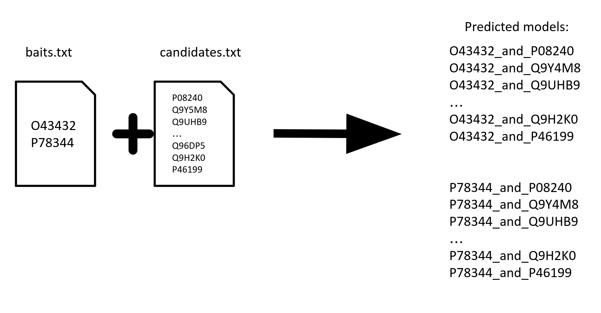

# AlphaPulldown manual (run via singularity image):

## Step 0:
Remember to download AlphaPulldown's singularity image first and know the path to your downloaded image. 

Check if you have downloaded necessary parameters and databases(e.g. BFD, MGnify etc.) as instructed in [AlphFold's documentation](https://github.com/deepmind/alphafold) and you should have a directory like below:
 ```
 alphafold_database/                             # Total: ~ 2.2 TB (download: 438 GB)
    bfd/                                   # ~ 1.7 TB (download: 271.6 GB)
        # 6 files.
    mgnify/                                # ~ 64 GB (download: 32.9 GB)
        mgy_clusters_2018_12.fa
    params/                                # ~ 3.5 GB (download: 3.5 GB)
        # 5 CASP14 models,
        # 5 pTM models,
        # 5 AlphaFold-Multimer models,
        # LICENSE,
        # = 16 files.
    pdb70/                                 # ~ 56 GB (download: 19.5 GB)
        # 9 files.
    pdb_mmcif/                             # ~ 206 GB (download: 46 GB)
        mmcif_files/
            # About 180,000 .cif files.
        obsolete.dat
    pdb_seqres/                            # ~ 0.2 GB (download: 0.2 GB)
        pdb_seqres.txt
    small_bfd/                             # ~ 17 GB (download: 9.6 GB)
        bfd-first_non_consensus_sequences.fasta
    uniclust30/                            # ~ 86 GB (download: 24.9 GB)
        uniclust30_2018_08/
            # 13 files.
    uniprot/                               # ~ 98.3 GB (download: 49 GB)
        uniprot.fasta
    uniref90/                              # ~ 58 GB (download: 29.7 GB)
        uniref90.fasta
 ```

# Example1
# Aim: Find proteins involving human translation pathway that might also interact with eIF4G3 or eIF4G2 
## 1st step: compute multiple sequence alignment (MSA) and template features (run on CPUs)
Firstly, download all 294 proteins that belong to human tranlsation pathway from Reactome: [link](https://reactome.org/PathwayBrowser/#/R-HSA-72766&DTAB=MT)

Then add the sequence of eIF4G3(Uniprot:[O43432](https://www.uniprot.org/uniprot/O43432)) and eIF4G2(Uniprot:[P78344](https://www.uniprot.org/uniprot/P78344)) to the sequences. The results: [```./example_data/example_1_sequences.fasta```](./example_data/example_1_sequences.fasta)
Now run:
```bash
singularity exec --no-home --bind $PWD/example_data/example_1_sequences.fasta:/input_data/example_1_sequences.fasta\
--bind <path to alphafold databases>:/data_dir\ 
--bind <dir to save output objects>:/output_dir\
<path to your downloaded image>/alphapulldown.sif create_individual_features.py\ 
--fasta_paths=/input_data/example_1_sequences.fasta --data_dir=/data_dir --output_dir=output_dir 
--max_template_date=<any date you want> --seq_index=<any number you want>
```

```create_individual_features.py``` will compute necessary features each protein in [```./example_data/example_1_sequences.fasta```](./example_data/example_1_sequences.fasta) and store them in the ```output_dir```. Please be aware that everything after ```>``` will be 
taken as the description of the protein and make sure do **NOT** include any special symbol, such as ```|```, after ```>```. However, ```-``` or ```_```is allowed. 
 The name of the pickles will be the same as the descriptions of the sequences  in fasta files (e.g. ">protein_A" in the fasta file will yield "protein_A.pkl")
 
 ------------------------

## 1.1 Explanation about the parameters
####  **```save_msa_files```** 
By default is **False** to save storage stage but can be changed into **True**. If it is set to be ```True```, the programme will 
create individual folder for each protein. The output directory will look like:
```
 output_dir
      |- protein_A.pkl
      |- protein_A
            |- uniref90_hits.sto
            |- pdb_hits.sto
            |- etc.
      |- protein_B.pkl
      |- protein_B
            |- uniref90_hits.sto
            |- pdb_hits.sto
            |- etc.
 ```
 
 
If ```save_msa_files=False``` then the ```output_dir``` will look like:
 ```
 output_dir
      |- protein_A.pkl
      |- protine_B.pkl
 ```
 
 --------------------
 
 ####  **```use_precomputed_msas```**
 Default value is ```False```. However, if you have already had msa files for your proteins, please set the parameter to be True and arrange your msa files in the format as below:
 ```
 example_directory
      |- protein_A 
            |- uniref90_hits.sto
            |- pdb_hits.sto
            |-***.a3m
            |- etc
      |- protein_B
            |- ***.sto
            |- etc
 ```
Then, in the command line, set the ```output_dir=/path/to/example_directory```

####  **```skip_existing```**
Default is ```False``` but if you have run the 1st step already for some proteins and now add new proteins to the list, you can change ```skip_existing``` to ```True``` in the
command line to avoid rerunning the same procedure for the previously calculated proteins.

####  **```seq_index```**
Default is `None` and the programme will run predictions one by one in the given files. However, you can set ```seq_index``` to 
different number if you wish to run an array of jobs in parallel then the programme will only run the corresponding job specified by the ```seq_index```. e.g. the programme only calculate features for the 1st protein in your fasta file if ```seq_index``` is set to be 1.

**NB**: ```seq_index``` starts from 1. 

---------------------

## 2nd step: Predict structures (run on GPU)

#### **Run in pulldown mode**
Inspired by pull-down assays, one can specify one or more proteins as "bait" and another list of proteins as "candidates". Then the programme will use AlphafoldMultimerV2 to predict interactions between baits (as in [example_data/baits.txt](./example_data/baits.txt)) and candidates (as in [example_data/candidates.txt](./example_data/candidates.txt)). 

In this example, we selected pulldown mode and make eIF4G3(Uniprot:[O43432](https://www.uniprot.org/uniprot/O43432)) and eIF4G2(Uniprot:[P78344](https://www.uniprot.org/uniprot/P78344)) as baits while the other 294 proteins as candidates. Thus, in total, there will be 2 * 294 = 588 predictions. 




**NB** The command line interface for using pulldown mode will then become:
```bash
singularity exec --no-home\ 
--bind $PWD/example_data/baits.txt:/input_data/baits.txt\
--bind $PWD/example_data/candidates.txt:/input_data/candidates.txt\
--bind <path to alphafold databases>:/data_dir\
--bind <dir to save predicted models>:/output_dir\ 
--bind <path to directory storing monomer objects >:/monomer_object_dir\
<path to your downloaded image>/alphapulldown.sif run_multimer_jobs.py --mode=pulldown\
--num_cycle=3 --num_predictions_per_model=1\
--output_path=/output_dir 
--data_dir=/data_dir\ 
--protein_lists=/input_data/baits.txt,/input_data/candidates.txt\
--monomer_objects_dir=/monomer_object_dir
--job_index=<any number you want>
```

**Another explanation about the parameters**
####  **```<path to directory storing monomer objects>```**
It should be the same directory as ```output_dir``` specified in **Step 1**. It can be one directory or contain multiple directories if you stored pre-calculated objects in different locations. In the case of 
multiple ```monomer_objects_dir```, remember to put a `,` between each e.g. ``` --monomer_objects_dir=<dir_1>,<dir_2>```

####  **```job_index```**
Default is `None` and the programme will run predictions one by one in the given files. However, you can set ```job_index``` to 
different number if you wish to run an array of jobs in parallel then the programme will only run the corresponding job specified by the ```job_index```

**NB** ```job_index``` starts from 1

--------------------


## 3rd step Evalutaion and visualisation
We have also created an analysis pipeline and can be directly run by singularity. 

Firstly, download the singularity image from [here](https://oc.embl.de/index.php/s/cDYsOOdXA1YmInk).

Then execute the singularity image ( i.e. the sif file) by:
```
singularity exec --no-home --bind /path/to/your/output/dir:/mnt 
/path/to/your/sif/file/alpha-analysis.sif run_get_good_pae.sh --output_dir=/mnt --cutoff=5 --create_notebook=True
```

**About the parameters**

```/path/to/your/output/dir``` should be the direct result of the 2nd step as demonstrated above. 

```cutoff``` is to check the value of PAE between chains. In the case of multimers, the analysis programme will check whether any PAE values between two chains are smaller than the cutoff, as illustracted in the figure below:

```create_notebook``` is a boolean variable, for those predictions with good PAE scores between chains, would you like to create a jupyter notebook that shows the PAE, predicted models coloured by plDDT, and predicted models coloured by chains? A screen shot of an example notebook is shown below:

**About the outputs**
By default, you will have a csv file named ```predictions_with_good_interpae.csv``` created in the directory ```/path/to/your/output/dir``` as you have given in the command above. ```predictions_with_good_interpae.csv``` reports:1.iptm, iptm+ptm scores provided by AlphaFold 2. mpDockQ score developed by[ Bryant _et al._, 2022](https://gitlab.com/patrickbryant1/molpc)  3. PI_score developed by [Malhotra _et al._, 2021](https://gitlab.com/sm2185/ppi_scoring/-/wikis/home). The detailed explainations on these scores can be found in out paper.

If ```create_notebook=True```, then there will be a jupyter notebook named ```output.ipynb``` in the  ```/path/to/your/output/dir```. It is recommended uploading this jupyter notebook to google drive and viewing it via google's colabotary APP because the notebook can be very large and some features may not be properly installed in your local IDE.

------------------------------------------------------------
## Appendix: Instructions on running in all_vs_all mode
As the name suggest, all_vs_all means predict all possible combinations within a single input file. The input can be either full-length proteins or regions of a protein, as illustrated in the [example_all_vs_all_list.txt](./example_data/example_all_vs_all_list.txt) and the figure below:

 
```bash
singulairty exec --no-home\
--bind <output directory>:/output_dir\
--bind <path to monomer_objects_directory>:/monomer_directory\
--bind $PWD/example_data/example_all_vs_all_list.txt:/input_data/example_all_vs_all_list.txt\
--bind <path to alphafold databases>:/data_dir
<path to your downloaded image>/alphapulldown.sif run_multimer_jobs.py --mode=all_vs_all\
--num_cycle=3 --num_predictions_per_model=1\
--output_path=/output_dir\ 
--data_dir=/data_dir\ 
--protein_lists=$PWD/example_data/example_all_vs_all_list.txt\
--monomer_objects_dir=/monomer_directory
--job_index=<any number you want>
```
