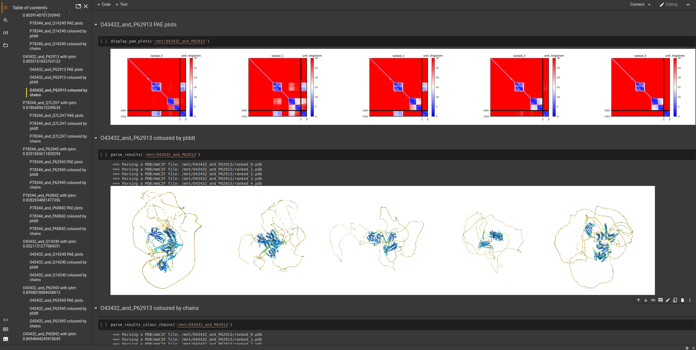
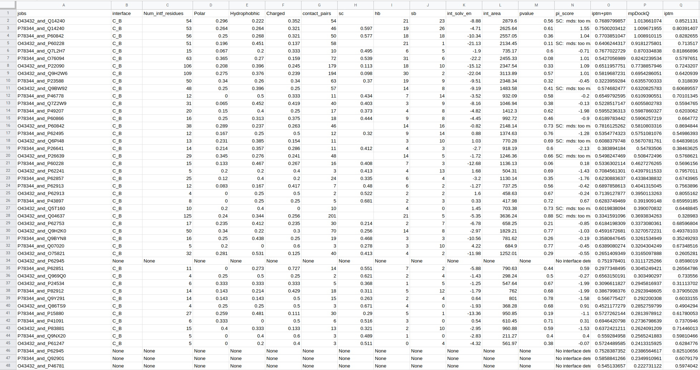

# AlphaPulldown manual:
# Example2
# Aims: Model interactions between Lassa virus L protein and Z matrix protein; predict the structure of Z matrix protein homo 12-mer 
## 1st step: compute multiple sequence alignment (MSA) and template features (run on CPUs)

Firstly, download sequences of L(Uniprot: [O09705](https://www.uniprot.org/uniprotkb/O09705/entry)) and Z(uniprot:[O73557](https://www.uniprot.org/uniprotkb/O73557/entry)) proteins. The result is [```example_data/example_2_sequences.fasta```](./example_data/example_2_sequences.fasta)

Now run:
```bash
  create_individual_features.py \
    --fasta_paths=example_2_sequences.fasta \
    --data_dir=<path to alphafold databases> \
    --save_msa_files=False \
    --output_dir=<dir to save the output objects> \ 
    --use_precomputed_msas=False \
    --max_template_date=<any date you want> \
    --skip_existing=False --seq_index=<any number you want>
```

```create_individual_features.py``` will compute necessary features for O73557 and O09705 then store them as individual pickle files in the ```output_dir```. Please be aware that in the fasta files, everything after ```>``` will be 
taken as the description of the protein and  **please be aware** that any special symbol, such as ```| : ; #```, after ```>``` will be replaced with ```_```. 
 The name of the pickles will be the same as the descriptions of the sequences  in fasta files (e.g. ">protein_A" in the fasta file will yield "protein_A.pkl")
 
 ------------------------

## 1.1 Explanation about the parameters

See [Example 1](https://github.com/KosinskiLab/AlphaPulldown/blob/main/example_1.md#11-explanation-about-the-parameters)

## 2nd step: Predict structures (run on GPU)

#### **Task 1**
We want to predict the structure of full-length L protein together with Z protein. However, as the L protein is very long, many users would not have a GPU card with sufficient memory. Moreover, when attempting modeling the full L-Z, the resulting model does not match the known cryo-EM structure. In [Example 1](https://github.com/KosinskiLab/AlphaPulldown/blob/main/example_1.md), we showed how to use AlphaPulldown to find the interaction site by screening fragments using the ```pullldown``` mode. Here, to demonstrate the ```custom``` mode, we will assume the we know the interaction site and model the fragment using this mode, as demonstrated in the figure below :


Different proteins are seperated by ```;```. If a particular region is wanted from one protein, simply add ```,``` after that protein and followed by the region. Region comes in the format of ```number1-number2```. An example input file is: [```example_data/cutom_mode.txt```](./example_data/custom_mode.txt)

The command line interface for using custom mode will then become:

```
run_multimer_jobs.py \
  --mode=custom \
  --num_cycle=3 \
  --num_predictions_per_model=1 \
  --output_path=<path to output directory> \ 
  --data_dir=<path to AlphaFold data directory> \ 
  --protein_lists=custom_mode.txt \
  --monomer_objects_dir=/path/to/monomer_objects_directory \
  --job_index=<any number you want>
```

#### **Task 2**
This taks is to model the homo 12-mer of Z protein. Thus, homo-oligomer mode is needed. An oligomer state file will tell the programme the number of units. An example is: [```example_data/example_oligomer_state_file.txt```](./example_data/example_oligomer_state_file.txt)

In the file, oligomeric states of the corresponding proteins should be separated by ```,``` e.g. ```protein_A,3```means a homotrimer for protein_A  


Instead of homo-oligomers, this mode can also be used to predict monomeric structure by simply adding ```1``` or nothing after the protein. 
The command for homo-oligomer mode is:

```
run_multimer_jobs.py --mode=homo-oligomer --output_path=<path to output directory> \ 
--oligomer_state_file=$PWD/example_data/example_oligomer_state_file.txt \ 
--monomer_objects_dir=<directory that stores monomer pickle files> \ 
--data_dir=/path-to-Alphafold-data-dir \ 
--job_index=<any number you want>
```


----------------------------------

## Explanation about the parameters

See [Example 2](https://github.com/KosinskiLab/AlphaPulldown/blob/main/example_1.md#explanation-about-the-parameters)

--------------------


## 3rd step Evalutaion and visualisation

**Feature 1**

When a batch of jobs is finished, AlphaPulldown can create a jupyter notebook that presents a neat overview of the models, as seen in the example screenshot 

On the left side, there is a bookmark listing all the jobs and when clicking a bookmark, the notebook will show: 1) PAE plots 2) predicted model coloured by plddt scores 3) predicted models coloured by chains.

In order to create the notebook, within the same conda environment, run:
```bash
source activate AlphaPulldown
create_notebook.py --output_dir=/mnt --cutoff=5.0
```
This command will yield an ```output.ipynb``` and you can open it via Jupyterlab. Jupyterlab is already installed when pip installing AlphapullDown. Thus, to view the notebook: 

```bash
source activate AlphaPulldown
cd /scratch/user/output/models
jupyter-lab 
```

**About the parameters**

```/scratch/user/output/model``` should be the direct result of the 2nd step as demonstrated above. 

```cutoff``` is to check the value of PAE between chains. In the case of multimers, the analysis programme will check whether any PAE values between two chains are smaller than the cutoff and only display those models that satisfies the cutoff.


**Feature 2**

We have also provided another singularity image to generate a csv table with structural properties and scores.
Firstly, download the singularity image from [here](https://www.embl-hamburg.de/AlphaPulldown/downloads/alpha-analysis.sif).Chrome user may not be able to download it after cliking the link. If so, please right click and select "save link as".


Then execute the singularity image (i.e. the sif file) by:
```
singularity exec --no-home --bind /path/to/your/output/dir:/mnt \
/path/to/your/sif/file/alpha-analysis.sif run_get_good_pae.sh --output_dir=/mnt --cutoff=10
```

**About the outputs**
By default, you will have a csv file named ```predictions_with_good_interpae.csv``` created in the directory ```/path/to/your/output/dir``` as you have given in the command above. ```predictions_with_good_interpae.csv``` reports:1.iptm, iptm+ptm scores provided by AlphaFold 2. mpDockQ score developed by[ Bryant _et al._, 2022](https://gitlab.com/patrickbryant1/molpc)  3. PI_score developed by [Malhotra _et al._, 2021](https://gitlab.com/sm2185/ppi_scoring/-/wikis/home). The detailed explainations on these scores can be found in our paper and an example screenshot of the table is below. 


------------------------------------------------------------
## Appendix: Instructions on running in all_vs_all mode
As the name suggest, all_vs_all means predict all possible combinations within a single input file. The input can be either full-length proteins or regions of a protein, as illustrated in the [example_all_vs_all_list.txt](./example_data/example_all_vs_all_list.txt) and the figure below:


 The corresponding command is: 
```bash
run_multimer_jobs.py --mode=all_vs_all \
--num_cycle=3 --num_predictions_per_model=1 \
--output_path=<path to output directory> \ 
--data_dir=/path-to-Alphafold-data-dir \ 
--protein_lists=$PWD/example_data/example_all_vs_all_list.txt \
--monomer_objects_dir=/path/to/monomer_objects_directory \
--job_index=<any number you want>
```
