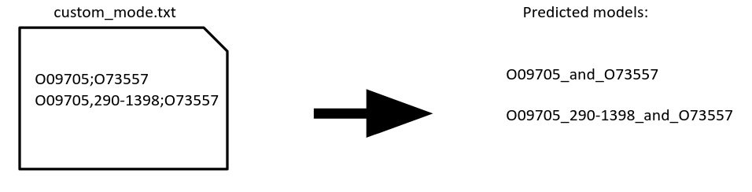

# AlphaPulldown manual:

# Example2

# Aims: Model interactions between Lassa virus L protein and Z matrix protein; Determine the oligomer state of _E.coli_ Single-stranded DNA-binding protein (SSB)

## 1st step: compute multiple sequence alignment (MSA) and template features (run on CPUs)

Firstly, download sequences of L (Uniprot: [O09705](https://www.uniprot.org/uniprotkb/O09705/entry)) and Z(uniprot:[O73557](https://www.uniprot.org/uniprotkb/O73557/entry)) proteins. The result is [`example_2_sequences.fasta`](../example_data/example_2_sequences.fasta)

Now run:

```bash
  create_individual_features.py \
    --fasta_paths=example_2_sequences.fasta \
    --data_dir=<path to alphafold databases> \
    --save_msa_files=False \
    --output_dir=<dir to save the output objects> \ 
    --use_precomputed_msas=False \
    --max_template_date=<any date you want> \
    --skip_existing=False --seq_index=<any number you want>
```

```create_individual_features.py``` will compute necessary features for O73557 and O09705 then store them as individual pickle files in the ```output_dir```. Please be aware that in the fasta files, everything after ```>``` will be 
taken as the description of the protein and  **please be aware** that any special symbol, such as ```| : ; #```, after ```>``` will be replaced with ```_```. 
 The name of the pickles will be the same as the descriptions of the sequences  in fasta files (e.g. ">protein_A" in the fasta file will yield "protein_A.pkl")
 
 ------------------------

## 1.1 Explanation about the parameters

See [Example 1](https://github.com/KosinskiLab/AlphaPulldown/blob/main/example_1.md#11-explanation-about-the-parameters)

## 2nd step: Predict structures (run on GPU)

#### **Task 1**
We want to predict the structure of full-length L protein together with Z protein. However, as the L protein is very long, many users would not have a GPU card with sufficient memory. Moreover, when attempting modeling the full L-Z, the resulting model does not match the known cryo-EM structure. In [Example 1](https://github.com/KosinskiLab/AlphaPulldown/blob/main/example_1.md), we showed how to use AlphaPulldown to find the interaction site by screening fragments using the ```pullldown``` mode. Here, to demonstrate the ```custom``` mode, we will assume the we know the interaction site and model the fragment using this mode, as demonstrated in the figure below :


Different proteins are seperated by ```;```. If a particular region is wanted from one protein, simply add ```,``` after that protein and followed by the region. Region comes in the format of ```number1-number2```. An example input file is: [`custom_mode.txt`](../example_data/custom_mode.txt)

The command line interface for using custom mode will then become:

```
run_multimer_jobs.py \
  --mode=custom \
  --num_cycle=3 \
  --num_predictions_per_model=1 \
  --output_path=<path to output directory> \ 
  --data_dir=<path to AlphaFold data directory> \ 
  --protein_lists=custom_mode.txt \
  --monomer_objects_dir=/path/to/monomer_objects_directory \
  --job_index=<any number you want>
```

### (**Optionally**) Running with mmseqs2 against colabfold databases instead. 
Some of the users may be more familiar with mmseqs2 and colabfold databases. Sometimes, using remote mmseqs2 server can finish MSA calculation even faster than the above method. If you are interested in running mmseqs2, please refer to [this manual](./mmseqs2_manual.md) 
:memo: Please be aware that mmseqs2 and colabfold databases give different MSA from alphafold's database and HHBlits. Therefore, the predicted models are not always the same when using the these two different ways of generating MSA alignments. 

### Running on a computer cluster in parallel

On a compute cluster, you may want to run all jobs in parallel as a [job array](https://slurm.schedmd.com/job_array.html). For example, on SLURM queuing system at EMBL we could use the following ```run_multimer_jobs_SLURM.sh``` sbatch script:

```bash
#!/bin/bash

#A typical run takes couple of hours but may be much longer
#SBATCH --job-name=array
#SBATCH --time=2-00:00:00

#log files:
#SBATCH -e logs/run_multimer_jobs_%A_%a_err.txt
#SBATCH -o logs/run_multimer_jobs_%A_%a_out.txt

#qos sets priority
#SBATCH --qos=low

#SBATCH -p gpu-el8
#You might want to use a higher-end card in case higher oligomeric state get big:
#SBATCH -C "gpu=A40|gpu=A100"

#Reserve the entire GPU so no-one else slows you down
#SBATCH --gres=gpu:1

#Limit the run to a single node
#SBATCH -N 1

#Adjust this depending on the node
#SBATCH --ntasks=8
#SBATCH --mem=128000

module load Anaconda3 
module load CUDA/11.8.0
module load cuDNN/8.7.0.84-CUDA-11.8.0
source activate AlphaPulldown

MAXRAM=$(echo `ulimit -m` '/ 1024.0'|bc)
GPUMEM=`nvidia-smi --query-gpu=memory.total --format=csv,noheader,nounits|tail -1`
export XLA_PYTHON_CLIENT_MEM_FRACTION=`echo "scale=3;$MAXRAM / $GPUMEM"|bc`
export TF_FORCE_UNIFIED_MEMORY='1'

run_multimer_jobs.py  \
  --mode=custom \
  --num_cycle=3 \
  --num_predictions_per_model=1 \
  --output_path=<path to output directory> \ 
  --data_dir=<path to AlphaFold data directory> \ 
  --protein_lists=custom_mode.txt \
  --monomer_objects_dir=/path/to/monomer_objects_directory \
  --job_index=$SLURM_ARRAY_TASK_ID    
```
and then run using:
```
mkdir -p logs
count=`grep -c "" custom_mode.txt` #count lines even if the last one has no end of line
sbatch --array=1-$count run_multimer_jobs_SLURM.sh
```
:exclamation: To speed up computations, by default AlphaPulldown does not run relaxation (energy minimization) of models, which may decrease the quality of local geometry. If you want to enable it either only for the best models or for all predicted models, please add one of these flags to your command:
```
--models_to_relax=best
```
or
```
--models_to_relax=all
```

#### **Task 2**
This taks is to determine the oligomer state of SSB protein [(Uniprot:P0AGE0)](https://www.uniprot.org/uniprotkb/P0AGE0/entry#function) by modelling its monomeric, homodimeric, homotrimeric, and homoquatrameric structures. Thus, homo-oligomer mode is needed. An oligomer state file will tell the programme the number of units. An example is: [`example_oligomer_state_file.txt`](../example_data/example_oligomer_state_file.txt)

In the file, oligomeric states of the corresponding proteins should be separated by ```,``` e.g. ```protein_A,3```means a homotrimer for protein_A  


Instead of homo-oligomers, this mode can also be used to predict monomeric structure by simply adding ```1``` or nothing after the protein. 
The command for homo-oligomer mode is:

```
run_multimer_jobs.py \
  --mode=homo-oligomer \
  --output_path=<path to output directory> \ 
  --num_cycle=3 \
  --oligomer_state_file=example_oligomer_state_file.txt \ 
  --monomer_objects_dir=<directory that stores monomer pickle files> \ 
  --data_dir=/path-to-Alphafold-data-dir \ 
  --job_index=<any number you want>
```

Having screened the oligomeric states of SSB protein, we found our tetramer model agrees with the experimental structure (PDB:4MZ9). 

----------------------------------

## Explanation about the parameters

####  **```monomer_objects_dir```**

It should be the same directory as ```output_dir``` specified in **Step 1**. It can be one directory or contain multiple directories if you stored pre-calculated objects in different locations. In the case of 
multiple ```monomer_objects_dir```, remember to put a `,` between each e.g. ``` --monomer_objects_dir=<dir_1>,<dir_2>```

####  **```job_index```**

Default is `None` and the programme will run predictions one by one in the given files. However, you can set ```job_index``` to 
different number if you wish to run an array of jobs in parallel then the programme will only run the corresponding job specified by the ```job_index```

:exclamation: ```job_index``` starts from 1

🆕 now can reduce the size of the output folders via ```remove_result_pickles``` and ```compress_result_pickles```

By default these 2 are set to False. ```compress_result_pickles=True``` will compress all the result pickles by gzip. ```remove_result_pickles=True``` will remove result pikles that do not belong to the best model. 

✨ **New Features** Now AlphaPulldown supports integrative structural modelling if the user has experimental cross-link data. Please refer to [this manual](run_with_AlphaLink2.md) if you'd like to model your protein complexes with cross-link MS data as extra input.

### Running on a computer cluster in parallel

On a compute cluster, you may want to run all jobs in parallel as a [job array](https://slurm.schedmd.com/job_array.html). For example, on SLURM queuing system at EMBL we could use the following ```run_multimer_jobs_SLURM.sh``` sbatch script:

```bash
#!/bin/bash

#A typical run takes couple of hours but may be much longer
#SBATCH --job-name=array
#SBATCH --time=2-00:00:00

#log files:
#SBATCH -e logs/run_multimer_jobs_%A_%a_err.txt
#SBATCH -o logs/run_multimer_jobs_%A_%a_out.txt

#qos sets priority
#SBATCH --qos=low

#SBATCH -p gpu-el8
#You might want to use a higher-end card in case higher oligomeric state get big:
#SBATCH -C "gpu=A40|gpu=A100"

#Reserve the entire GPU so no-one else slows you down
#SBATCH --gres=gpu:1

#Limit the run to a single node
#SBATCH -N 1

#Adjust this depending on the node
#SBATCH --ntasks=8
#SBATCH --mem=128000

module load Anaconda3 
module load CUDA/11.8.0
module load cuDNN/8.7.0.84-CUDA-11.8.0
source activate AlphaPulldown

MAXRAM=$(echo `ulimit -m` '/ 1024.0'|bc)
GPUMEM=`nvidia-smi --query-gpu=memory.total --format=csv,noheader,nounits|tail -1`
export XLA_PYTHON_CLIENT_MEM_FRACTION=`echo "scale=3;$MAXRAM / $GPUMEM"|bc`
export TF_FORCE_UNIFIED_MEMORY='1'

run_multimer_jobs.py \
  --mode=homo-oligomer \
  --output_path=<path to output directory> \ 
  --num_cycle=3 \
  --oligomer_state_file=example_oligomer_state_file.txt \ 
  --monomer_objects_dir=<directory that stores monomer pickle files> \ 
  --data_dir=/path-to-Alphafold-data-dir \ 
  --job_index=$SLURM_ARRAY_TASK_ID    
```
and then run using:

```
mkdir -p logs
count=`grep -c "" example_oligomer_state_file.txt` #count lines even if the last one has no end of line
sbatch --array=1-$count run_multimer_jobs_SLURM.sh
```

--------------------


## 3rd step: Evaluation and visualisation

**Feature 1**

When a batch of jobs is finished, AlphaPulldown can create a [Jupyter](https://jupyter.org/) notebook that presents a neat overview of the models, as seen in the example screenshot 

On the left side, there is a bookmark listing all the jobs and when clicking a bookmark, and executing the corresponding cells, the notebook will show: 1) PAE plots 2) predicted model coloured by pLDDT scores 3) predicted models coloured by chains.

In order to create the notebook, within the same conda environment, run:

```bash
source activate AlphaPulldown
cd <models_output_dir>
create_notebook.py --cutoff=5.0 --output_dir=<models_output_dir>
```

:warning: The command must be run within the ```<output_dir>```!

This command will yield an ```output.ipynb```, which you can open it via Jupyterlab. Jupyterlab is already installed when installing AlphaPulldown with pip. Thus, to view the notebook: 

```bash
source activate AlphaPulldown
cd <models_output_dir>
jupyter-lab output.ipynb
```

:memo: *If you run AlphaPulldown on a remote computer cluster, you will need a graphical connection to open the notebook in a browser, mount the remote directory to your local computer as a network directory, or copy the entire ```<models_output_dir>``` to the local computer.*

**About the parameters**

```cutoff``` is to check the value of PAE between chains. In the case of multimers, the analysis programme will create the notebook only from models with inter-chain PAE values smaller than the cutoff.

**Feature 2**

We have also provided a singularity image called ```alpha-analysis.sif```to generate a CSV table with structural properties and scores.
Firstly, download the singularity image:

⚠️ If your results are from AlphaPulldown prior version 1.0.0: [alpha-analysis_jax_0.3.sif](https://www.embl-hamburg.de/AlphaPulldown/downloads/alpha-analysis_jax_0.3.sif). 

⚠️ If your results are from AlphaPulldown with version >=1.0.0: [alpha-analysis_jax_0.4.sif](https://www.embl-hamburg.de/AlphaPulldown/downloads/alpha-analysis_jax_0.4.sif). 
Chrome user may not be able to download it after clicking the link. If so, please right click and select "Save link as".

⚠️ If your results are from the latest beta version 2.0.0b3, please download: [alpha-analysis.sif](https://www.embl-hamburg.de/AlphaPulldown/downloads/alpha-analysis.sif)
Then execute the singularity image (i.e. the sif file) by:

```
singularity exec \
    --no-home \
    --bind /path/to/your/output/dir:/mnt \
    <path to your downloaded image>/alpha-analysis_jax_0.4.sif \
    run_get_good_pae.sh \
    --output_dir=/mnt \
    --cutoff=10
```

**About the outputs**
By default, you will have a csv file named ```predictions_with_good_interpae.csv``` created in the directory ```/path/to/your/output/dir``` as you have given in the command above. ```predictions_with_good_interpae.csv``` reports: 1. iptm, iptm+ptm scores provided by AlphaFold 2. mpDockQ score developed by [Bryant _et al._, 2022](https://gitlab.com/patrickbryant1/molpc)  3. PI_score developed by [Malhotra _et al._, 2021](https://gitlab.com/sm2185/ppi_scoring/-/wikis/home). The detailed explainations on these scores can be found in our paper and an example screenshot of the table is below. 

------------------------------------------------------------

## Appendix: Instructions on running in `all_vs_all` mode

As the name suggest, all_vs_all means predict all possible combinations within a single input file. The input can be either full-length proteins or regions of a protein, as illustrated in the [`example_all_vs_all_list.txt`](../example_data/example_all_vs_all_list.txt) and the figure below:


 The corresponding command is: 
```bash
run_multimer_jobs.py \
  --mode=all_vs_all \
  --num_cycle=3 \
  --num_predictions_per_model=1 \
  --output_path=<path to output directory> \ 
  --data_dir=/path-to-Alphafold-data-dir \ 
  --protein_lists=example_all_vs_all_list.txt \
  --monomer_objects_dir=/path/to/monomer_objects_directory \
  --job_index=<any number you want>
```
