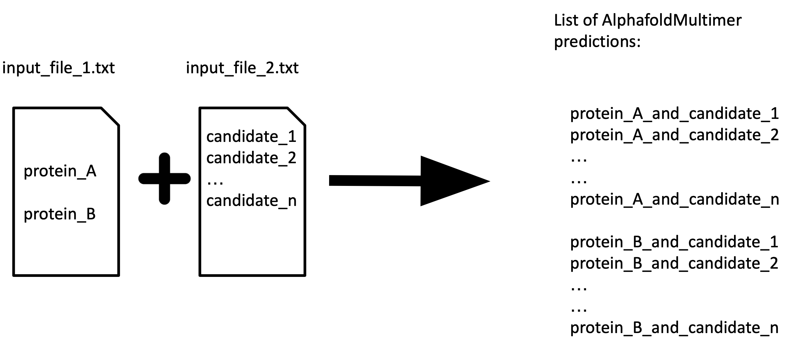
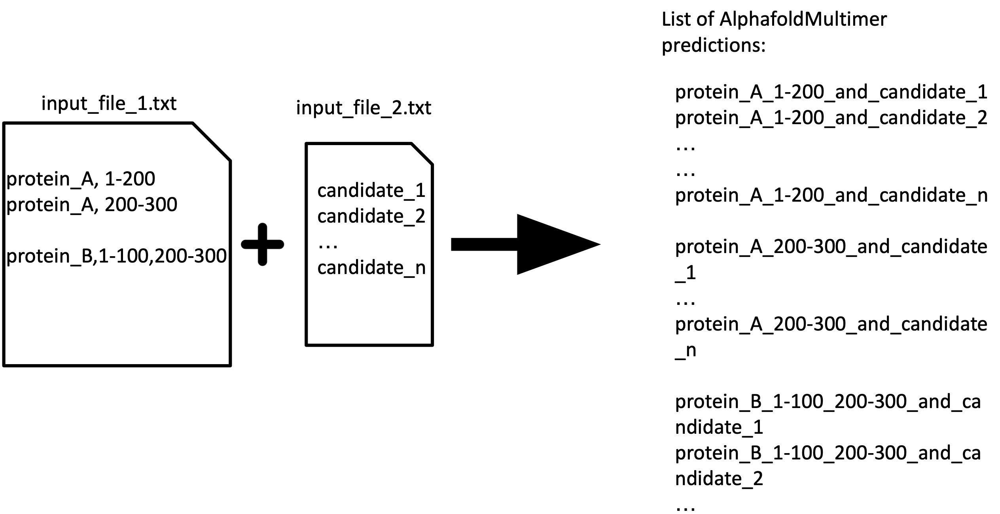
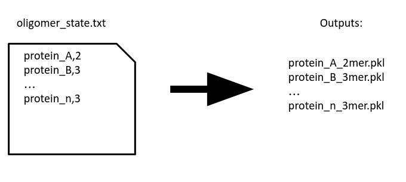

# AlphaPulldown manual (installed via pip):

## Step 0:
Remember to activate the conda env created while installing the package:
```bash
source activate <env_name>
```

Also make sure you have [HMMER](http://hmmer.org/documentation.html) and [HH-suite](https://github.com/soedinglab/hh-suite) **installed** and **configured !**

As for our **HD cluster**, simply:
```bash
module load HMMER/3.3.2-gompic-2020b
module load HH-suite/3.3.0-gompic-2020b
```

## 1st step: compute multiple sequence alignment (MSA) and template features (run on CPUs)

The main command is :
```bash
  create_individual_features.py\
    --fasta_paths=<path to your fasta>/<input_fasta>.fasta\
    --data_dir=<path to alphafold databases>\
    --save_msa_files=False\
    --output_dir=<dir to save the output objects>\ 
    --use_precomputed_msas=False\
    --skip_existing=False --seq_index
```

```create_individual_features.py``` will compute necessary features each protein in the ```<input_fasta>.fasta``` file and store them in the ```output_dir```. An example is:```test/test_data/proteins.fasta```. Please be aware that everything after ```>``` will be 
taken as the description of the protein and make sure do **NOT** include any special symbol, such as ```|```, after ```>```. However, ```-``` or ```_```is allowed. 
 The name of the pickles will be the same as the descriptions of the sequences  in fasta files (e.g. ">protein_A" in the fasta file will yield "protein_A.pkl")
 
 ------------------------

## 1.1 Explanation about the parameters
####  **```save_msa_files```** 
By default is **False** to save storage stage but can be changed into **True**. If it is set to be ```True```, the programme will 
create individual folder for each protein. The output directory will look like:
```
 output_dir
      |- protein_A.pkl
      |- protein_A
            |- uniref90_hits.sto
            |- pdb_hits.sto
            |- etc.
      |- protein_B.pkl
      |- protein_B
            |- uniref90_hits.sto
            |- pdb_hits.sto
            |- etc.
 ```
 An example output directory when ```save_msa_files=True``` would be ```test/test_result/O73557```
 
 
If ```save_msa_files=False``` then the ```output_dir``` will look like:
 ```
 output_dir
      |- protein_A.pkl
      |- protine_B.pkl
 ```
 
 --------------------
 
 ####  **```use_precomputed_msas```**
 Default value is ```False```. However, if you have already had msa files for your proteins, please set the parameter to be True and arrange your msa files in the format as below:
 ```
 example_directory
      |- protein_A 
            |- uniref90_hits.sto
            |- pdb_hits.sto
            |- etc
      |- protein_B
            |- ***.sto
            |-***.a3m
            |- etc
 ```
Then, in the command line, set the ```output_dir=/path/to/example_directory```

####  **```skip_existing```**
Default is ```False``` but if you have run the 1st step already for some proteins and now add new proteins to the list, you can change ```skip_existing``` to ```True``` in the
command line to avoid rerunning the same procedure for the previously calculated proteins.

####  **```seq_index```**
Default is `None` and the programme will run predictions one by one in the given files. However, you can set ```seq_index``` to 
different number if you wish to run an array of jobs in parallel then the programme will only run the corresponding job specified by the ```seq_index```. e.g. the programme only calculate features for the 1st protein in your fasta file if ```seq_index``` is set to be 1.

**NB**: ```seq_index``` starts from 1. 

---------------------

## 2nd step: Predict structures (run on GPU)
AlphaPulldown supports 3 different modes: pulldown, all_vs_all, and homo-oligomer 

#### **2.1 pulldown mode**
Inspired by pull-down assays, one can specify one or more proteins as "bait" and another list of proteins as "candidates". Then the programme will use AlphafoldMultimerV2 to predict interactions between baits and candidates. For instance:



However, in some cases, a functional domain may consist of multiple discontinuous regions. This programme also allows the user to split the proteins in such way, as indicated below:


**NB** The command line interface for using APMS mode will then become:
```
run_multimer_jobs.py --mode=pulldown\
--num_cycle=3 --num_predictions_per_model=1\
--output_path=/path/to/your/directory\ 
--data_dir=/path-to-Alphafold-data-dir\ 
--protein_lists=/path/to/file_1.txt,/path/to/file_2.txt,...,/path/to/file_n.txt \
--monomer_objects_dir=/path/to/monomer_objects_directory
--job_index=<any number you want>
```
## Another explanation about the parameters
####  **```monomer_objects_dir```**
It should be the same as ```output_dir``` in **Step 1**. It can be one directory or contain multiple directories if you stored pre-calculated objects in different locations. In the case of 
multiple ```monomer_objects_dir```, remember to put a `,` between each e.g. ``` --monomer_objects_dir=<dir_1>,<dir_2>```

####  **```job_index```**
Default is `None` and the programme will run predictions one by one in the given files. However, you can set ```job_index``` to 
different number if you wish to run an array of jobs in parallel then the programme will only run the corresponding job specified by the ```job_index```

Take the ```test/``` directory and the files in ```test/test_data/``` and ```test/test_result```as an example,the APMS mode will become:

```
python alphapassacaglia/run_multimer_jobs.py --mode=pulldown --output_path=/path/to/your/directory\
--protein_lists=test/test_data/test_bait.txt,test/test_data/test_candidate_list_1.txt,test/test_data/test_candidate_list_2.txt \
--monomer_objects_dir=test/test_result\
--data_dir=/path-to-Alphafold-data-dir\
--job_index=<any number you want>
```
--------------------

#### **2.2 all_vs_all mode**
As the name suggest, all_vs_all means predict all possible combinations within a single input file. The input can be either full-length proteins or reginos of a protein, as illustrated below:


```bash
python create_multimer_jobs.py --mode=all_vs_all --output_path=/path/you/want --protein_lists=./test/test_data/test_all_vs_all.txt\
--monomer_objects_dir=/g/kosinski/geoffrey/alpha-passacaglia/test/test_result/ 
```


---------------------------------------------

#### **2.3 homo-oligomer mode**


The programme also can fold homo-oligomers. Simply create a file indicated the oligomeric state of the corresponding protein, separated by ```,``` e.g. ```protein_A,3```means a homotrimer for protein_A. An example can be found in ```test/test_data/oligomer_state.txt```. 

**NB**: ```homo-oligomer``` mode can also predict monomers. Simply type nothing after the protein, such as : "protiein_A", or specify oligomer state to be 1, such as "protein_A,1", and the programme will predict a monomeric structure of protein_A. **However**, AlphaPulldown used hmmsearch instead of hhsearch when searching for structure templates in 1st step. As a result, predicted monomeric structure could differ from the prediction from default Alphafold monomer.  

Take the sturcture of```test/``` directory as an example, the command line input would be:
```
run_multimer_jobs.py --mode=homo-oligomer --output_path=/path/to/your/directory\ 
--oligomer_state_file=test/test_data/oligomer_state.txt\ 
--monomer_objects_dir=test/test_result\ 
--data_dir=/path-to-Alphafold-data-dir\ 
--job_index=<any number you want>
```
---------------------------------------

#### **2.4 custom mode**
The user can also just provide one single file in which each line contains a protein combination of desire. Different proteins are separated by ```;``` and if you'd like specific region of a particular protein, you can denote like ```protein_A,number1-number2```, as illustrated in the ```test/test_data/test_custom.txt``` and also in the picture below:


Take the structure of ```test/``` directory as an example, the command line input would be:

```
run_multimer_jobs.py --mode=custom --output_path=/path/to/your/directory\ 
--protein_lists=test_custom.txt\ 
--monomer_objects_dir=test/test_result\ 
--data_dir=/path-to-Alphafold-data-dir\ 
--job_index=<any number you want>
```

----------------------------------


## 3rd step: Evalutaion and visualisation
We have also created an analysis pipeline and can be directly run by singularity. 

Firstly, download the singularity image from [here](https://oc.embl.de/index.php/s/cDYsOOdXA1YmInk).

Then execute the singularity image ( i.e. the sif file) by:
```
singularity exec --no-home --bind /path/to/your/output/dir:/mnt 
/path/to/your/sif/file/alpha-analysis.sif run_get_good_pae.sh --output_dir=/mnt --cutoff=5 --create_notebook=True
```

**About the parameters**

```/path/to/your/output/dir``` should be the direct result of the 2nd step demonstrated above. 

```cutoff``` is to check the value of PAE between chains. In the case of multimers, the analysis programme will check whether any PAE values between two chains are smaller than the cutoff, as illustracted in the figure below:

```create_notebook``` is a boolean variable, for those predictions with good PAE scores between chains, would you like to create a jupyter notebook that shows the PAE, predicted models coloured by plDDT, and predicted models coloured by chains? A screen shot of an example notebook is shown below:

**About the outputs**
By default, you will have a csv file named ```predictions_with_good_interpae.csv``` created in the directory ```/path/to/your/output/dir``` as you have given in the command above. ```predictions_with_good_interpae.csv``` reports:1.iptm, iptm+ptm scores provided by AlphaFold 2. mpDockQ score developed by[ Bryant _et al._, 2022](https://gitlab.com/patrickbryant1/molpc)  3. PI_score developed by [Malhotra _et al._, 2021](https://gitlab.com/sm2185/ppi_scoring/-/wikis/home). The detailed explainations on these scores can be found in out paper.

If ```create_notebook=True```, then there will be a jupyter notebook named ```output.ipynb``` in the  ```/path/to/your/output/dir```. It is recommended uploading this jupyter notebook to google drive and viewing it via google's colabotary APP because the notebook can be very large and some features may not be properly installed in your local IDE.
