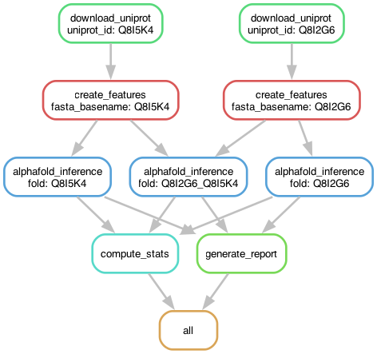

A snakemake pipeline for automated structure prediction using various backends.

## Installation

Before installation, make sure your python version is at least 3.10.

```bash
python3 --version
```

1. **Snakemake**: An integral workflow management system.

    ```bash
    pip install snakemake snakedeploy
    ```

2. **Cluster Setup**

    In order to allow snakemake to interface with a compute cluster, we are going to use the [Snakemake-Profile for SLURM](https://github.com/Snakemake-Profiles/slurm). If you are not working on a SLURM cluster you can find profiles for different architectures [here](https://github.com/Snakemake-Profiles/slurm). The following will create a profile that can be used with snakemake and prompt you for some additional information.

    ```bash
    pip install cookiecutter
    git clone https://github.com/Snakemake-Profiles/slurm.git
    profile_dir="${HOME}/.config/snakemake"
    mkdir -p "$profile_dir"
    template="gh:Snakemake-Profiles/slurm"
    cookiecutter --output-dir "$profile_dir" "$template"
    ```

    During the setup process, you will be prompted to answer several configuration questions. Below are the questions and the recommended responses:

    - `profile_name [slurm]:` **slurm_noSidecar**
    - `Select use_singularity:` **1 (False)**
    - `Select use_conda:` **1 (False)**
    - `jobs [500]:` *(Press Enter to accept default)*
    - `restart_times [0]:` *(Press Enter to accept default)*
    - `max_status_checks_per_second [10]:` *(Press Enter to accept default)*
    - `max_jobs_per_second [10]:` *(Press Enter to accept default)*
    - `latency_wait [5]:` **30**
    - `Select print_shell_commands:` **1 (False)**
    - `sbatch_defaults []:` **"qos=low nodes=1"**
    - `Select cluster_sidecar:` **2 (no)**
    - `cluster_name []:` *(Press Enter to leave blank)*
    - `cluster_jobname [%r_%w]:` *(Press Enter to accept default)*
    - `cluster_logpath [logs/slurm/%r/%j]:` *(Press Enter to accept default)*
    - `cluster_config []:` *(Press Enter to leave blank)*

    After responding to these prompts, your Slurm profile named *slurm_noSidecar* for Snakemake will be configured as specified.

3. **Singularity**: We make use of singularity containers in this pipeline. If you have not installed singularity, check the [official Singularity guide](https://sylabs.io/guides/latest/user-guide/quick_start.html#quick-installation-steps). If you are working on the EMBL cluster singularity is already installed and you can skip this step.


4. **Download the pipeline**:
    ```bash
    snakedeploy deploy-workflow https://github.com/KosinskiLab/AlphaPulldown/tree/snakemake_docker/snakemake . --branch snakemake_docker
    ```

## Configuration

Adjust `config/config.yaml` for your particular use case.

### input_files
This variable holds the path to your sample sheet, where each line corresponds to a folding job. For this pipeline we use the following format specification:

```
protein:N:start-stop[_protein:N:start-stop]*
```

where protein is a path to a file with '.fasta' extension or uniprot ID, N is the number of monomers for this particular protein and start and stop are the residues that should be predicted. However, only protein is required, N, start and stop can be omitted. Hence the following folding jobs for the protein example containing residues 1-50 are equivalent:

```
example:2
example_example
example:2:1-50
example:1-50_example:1-50
example:1:1-50_example:1:1-50
```

This format similarly extends for the folding of heteromers:

```
example1_example2
```

Assuming you have two sample sheets config/sample_sheet1.csv and config/sample_sheet2.csv. The following would be equivalent to computing all versus all in sample_sheet1.csv:

```
input_files :
  - config/sample_sheet1.csv
  - config/sample_sheet1.csv
```

while the snippet below would be equivalent to computing the pulldown between sample_sheet1.csv and sample_sheet2.csv

```
input_files :
  - config/sample_sheet1.csv
  - config/sample_sheet2.csv
```

This format can be extended to as many files as you would like, but keep in mind the number of folds will increase dramatically.

```
input_files :
  - config/sample_sheet1.csv
  - config/sample_sheet2.csv
  - ...lll
```

### alphafold_data_directory
This is the path to your alphafold database.

### output_directory
Snakemake will write the pipeline output to this directory. If it does not exist, it will be created.

### save_msa, use_precomputed_msa, predictions_per_model, number_of_recycles, report_cutoff
Command line arguments that were previously pasesed to AlphaPulldown's run_multimer_jobs.py and create_notebook.py (report_cutoff).

### alphafold_inference_threads, alphafold_inference
Slurm specific parameters that do not need to be modified by non-expert users.

### only_generate_features
If set to True, stops after generating features and does not perform structure prediction and reporting.

## Execution

After following the Installation and Configuration steps, you are now ready to run the snakemake pipeline. To do so, navigate into the cloned pipeline directory (/Users/vmaurer/src/alphaabriss in my case) and from within your shell run:

```bash
snakemake \
  --use-singularity \
  --singularity-args "-B /scratch:/scratch \
    -B /g/kosinski:/g/kosinski \
    --nv " \
  --jobs 200 \
  --restart-times 5 \
  --profile slurm_noSidecar \
  --rerun-incomplete \
  --rerun-triggers mtime \
  --latency-wait 30 \
  -n

```

Here's a breakdown of what each argument does:

- `--use-singularity`: Enables the use of Singularity containers. This allows for reproducibility and isolation of the pipeline environment.

- `--singularity-args`: Specifies arguments passed directly to Singularity. In the provided example:
  - `-B /scratch:/scratch` and `-B /g/kosinski:/g/kosinski`: These are bind mount points. They make directories from your host system accessible within the Singularity container. `--nv` ensures the container can make use of the hosts GPUs.

- `--profile name_of_your_profile`: Specifies the Snakemake profile to use (e.g., the SLURM profile you set up for cluster execution).

- `--rerun-triggers mtime`: Reruns a job if a specific file (trigger) has been modified more recently than the job's output. Here, `mtime` checks for file modification time.

- `--jobs 500`: Allows up to 500 jobs to be submitted to the cluster simultaneously.

- `--restart-times 10`: Specifies that jobs can be automatically restarted up to 10 times if they fail.

- `--rerun-incomplete`: Forces the rerun of any jobs that were left incomplete in previous Snakemake runs.

- `--latency-wait 30`: Waits for 30 seconds after a step finishes to check for the existence of expected output files. This can be useful in file-systems with high latencies.

- `-n`: Dry-run flag. This makes Snakemake display the commands it would run without actually executing them. It's useful for testing. To run the pipeline for real, simply remove this flag.

Executing the command above will perform submit the following jobs to the cluster:


